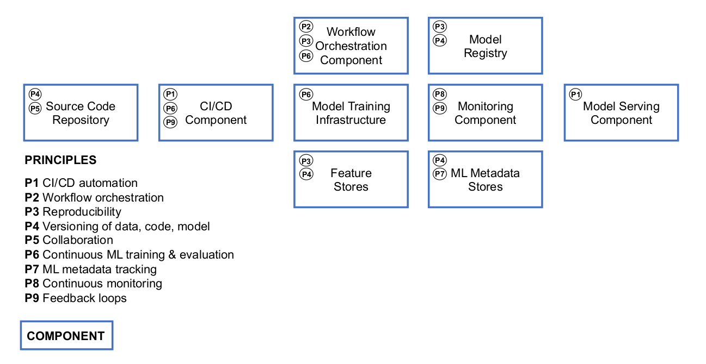

# Notes - Introduction


## What is MLOps

- **`MLOps`**: 
    - Paradigm that aims do deploy and maintain Machine Learning projects in production
    - Leverages concepts of Machine Learning, DevOps & Data Engineering
    - Set of best practices

<p align="center">
    
    <figcaption align="center"><b>Figure 2.</b> Implementation of principles within technical components <a href="#ref1">[1]</a>(License: <a href="https://creativecommons.org/licenses/by-nc-nd/4.0/">Creative Commons</a>)</figcaption>
</p>

MLOps helps us in the stages of
- Designing (a ML Model)
- Training (automated; easy execution)
- Operating (deploying)

## MLOps maturity model
TODO

## Running example: NY Taxi trips dataset
TODO

## Why do we need MLOps
TODO

## Course overview
TODO

## Environment preparation

### <u>On local computer</u>

Skip everything AWS realated, and start directly with the Anaconda-Installation.

### <u>On AWS</u>

#### Create AWS EC2-Instance
1. Log in to AWS
2. Search for [**`EC2`**](https://console.aws.amazon.com/ec2/)
3. Click on orange button **`Launch Instance`**
4. Choose a name for the EC2-Instance (e.g. *mlops-zoomcamp*)
6. In **`Application and OS Images (Amazon Machine Image)`** choose 
    - OS: `Ubuntu`
    - Architecture: `64-bit(x86)`
7. In **`Instance type`** choose type accoding to your needs, like ...
    - `t2.micro` (Free tier eligible)
        - Family: t2
        - 1 vCPU
        - 1 GiB Memory
    - `t2.large`:
        - Family: t2
        - 2 vCPU
        - 8 GiB Memory
8. Create a **`Key pair`**
    - Choose type `RSA`
    - Choose format `pem` 
    - Save to `.ssh` (on linux)
    - Make key read-only (required) with `chmod 400 key.pem`
9. In **`Configure storage`** choose 30GB instead of 8GB.
10. Power on the EC2 Instance
11. Create or expand `config` in `.ssh`-folder
    ```
    Host mlops-zoomcamp
        HostName <CurrentIP>
        User ubuntu
        IdentityFile ~/.ssh/key.pem
        StrictHostKeyChecking no
    ```
    - **Important:** After Stopping an Instance, the IP-Address changes and has to be updated in the `config`-file

12. Login to the EC2-Instance with
- `ssh hostName`

#### **Installing required Software on AWS**
1. **Install** [**Anaconda**](https://www.anaconda.com/)
    ```sh
    wget https://repo.anaconda.com/archive/Anaconda3-2023.03-1-Linux-x86_64.sh
    bash Anaconda3-2023.03-1-Linux-x86_64.sh
    ```
2. **Updating existing packages**
    ```sh
    sudo apt update
    ```
3. **Install Docker**
    ```sh
    sudo apt install docker.io
    # To run docker without sudo
    sudo groupadd docker
    sudo usermod -aG docker $USER
    ```
4. **Install Docker Compose** 
    ```sh
    # Install docker-compose in a separate directory
    mkdir soft
    cd soft
    ```
    To get the latest release of Docker Compose, go to https://github.com/docker/compose and download the release for your OS.
    ```sh
    # Currently: Version 2.18.1 (May 2023) on Linux
    wget https://github.com/docker/compose/releases/download/v2.18.1/docker-compose-linux-x86_64 -O docker-compose
    # Make `docker-compose` executable
    chmod +x docker-compose
    # Add `docker-compose` to the PATH-Variable
    echo 'export PATH="${HOME}/soft:${PATH}"' >> ~/.bashrc
    # Update the environment-variables
    source ~/.bashrc
    ```
    Check if `docker-compose` is correctly installed
    ```sh
    which docker-compose
    ``` 
    Check if `docker` is correctly installed
    ```sh
    docker run hello-world
    ```

#### **Get the MLOps Zoomcamp Github-Repo**
With `https`
```sh
# When you only want to pull changes
git clone https://github.com/DataTalksClub/mlops-zoomcamp.git
```
or with `ssh` (see [here](https://docs.github.com/en/authentication/connecting-to-github-with-ssh/generating-a-new-ssh-key-and-adding-it-to-the-ssh-agent) for more details) 
```sh
# When you want to push and pull (relevant if you forked the repository)
git clone git@github.com:DataTalksClub/mlops-zoomcamp.git
```

#### **Use VS Code over SSH to work on the Code on AWS**
1. Install The `Remote - SSH` Extension in Vision Studio Code (Click [here](https://marketplace.visualstudio.com/items?itemName=ms-vscode-remote.remote-ssh) for more info)
2. Click on the green button on the lower left of `Visual Studio Code` on your local machine
    - Choose `Connect to Host` (entries of `~/.ssh/config` are displayed) and choose the previously defined ssh-connection `mlops-zoomcamp`
    - You are now working on the EC2-Instance on AWS
3. Click on the `Explorer`-Symbol on the left of `Visual Studio Code`, then `Open Folder` and navigate to the folder containing the Git-Repository.
4. Configure VS Code so that it `jupyter notebooks` can be accessed over a remote connection.
    - Open the console with ` Ctrl+Shift+` `
    - Go to the `PORTS`-Header and click `Forward a Port`
    - Set `Port` to `8888`. This will fill in `Local Address` with `localhost:8888`
    - Copy the local address (hovering over local address)
    - Run `jupyter notebook` command on AWS and get the link with the token
    - Put Link into local browser to get access to `jupyter notebook` on AWS


## Homework


**References:**

<a id="ref1" href="https://arxiv.org/abs/2205.02302">[1]</a> Machine Learning Operations (MLOps): Overview, Definition, and Architecture  


<a id="ref2" href="https://en.wikipedia.org/wiki/MLOps">[2]</a> Wikipedia: MLOps