# 2. Experiment tracking and model management

* [Slides](https://drive.google.com/file/d/1YtkAtOQS3wvY7yts_nosVlXrLQBq5q37/view?usp=sharing)

## Workshop: MLOps Zoomcamp - Experiment Tracking with Weights and Biases - Soumik Rakshit
- A (free) Weights and Biases account is required
- [Youtube-Link](https://www.youtube.com/watch?v=yNyqFMwEyL4)
- [Slides](https://docs.google.com/presentation/d/19Ops4rTx57vyCTEyo8KR-JGXnHP9hHWUcq2T4m4N-sg/edit#slide=id.g13e4c738292_0_0)
- [wandb-Repo to Workshop](https://github.com/soumik12345/mlops-zoomcamp-wandb)
- [Homework-Link (Section 2.7)](https://github.com/DataTalksClub/mlops-zoomcamp/blob/main/cohorts/2023/02-experiment-tracking/wandb.md)


## 2.1 Experiment tracking intro

### Concepts
- **`ML experiment`**: process of building ML model
- **`Experiment Run`**: trial of ML experiment
- **`Run artifact`**: data associated with experiment run
- **`Experiment Metadata`**

### Experiment tracking?!
- <u>Tracking all relevant information</u> of an ML experiment like: Code, Env., Data, Model, Hyperparameter, Metrics, etc.
- Relevance of Infoirmation depends on experiment

### Why is Experiment tracking important?
- **`Reproducibility`**: Just as with other sciences, Data Scientists want to be able to reproduce results of experiments
- **`Organization`**: Helps to organize the project when working with other people. Even when working alone, a certain amount of organization is usually beneficial for success of a project.
- **`Optimization`**: Automates the optimization of ML models.

### Tracking Experiments in Spreadsheets (is not enough!)
- Often filled manually and is error prone
- Spreadsheets are not a standard format for experiment tracking

### MLflow (a good alternative!)
[MLflow-Documentation](https://mlflow.org/docs/latest/index.html)

- Open Source platform for ML Lifecycle
- Installed as <u>python package with 4 main modules</u>: 
    - `Tracking`: focused on experiment tracking
    - `Models`: standard format for packaging ML models that can be used in downstream tools
    - `Model Registry`: centralized model store, set of APIs, and UI, to collaboratively <u>manage the full lifecycle of an MLflow Model</u>
    - `Projects`

### Using MLflow for experiment tracking
- Organization of experiments into runs to keep track of:
    - `Parameters`: path to dataset, preprocessing parameters, ...
    - `Metrics`: e.g. Accuracy, Precision, Recall from training and validation data, ...
    - `Metadata`: e.g. adding tags to runs, s.t. can be searched for in the future. Saving such information allows comparison between runs.
    - `Artifacts`: Any file that is used/generated with the model and is considered relevant for the run.
    - `Models`: Saving/Logging the model (if wanted). Often saving parameters that lead to the model is sufficient.
- Additionally the following information is also logged:
    - `Source Code`
    - `Version (Git)`: current commit
    - `Start- & End-Time`
    - `Author`

### MLflow Demo
Install **`MLflow`**
```bash
pip install mlflow
```

**Opening the MLflow UI**
```bash
mlflow ui
```
<p align="center">
    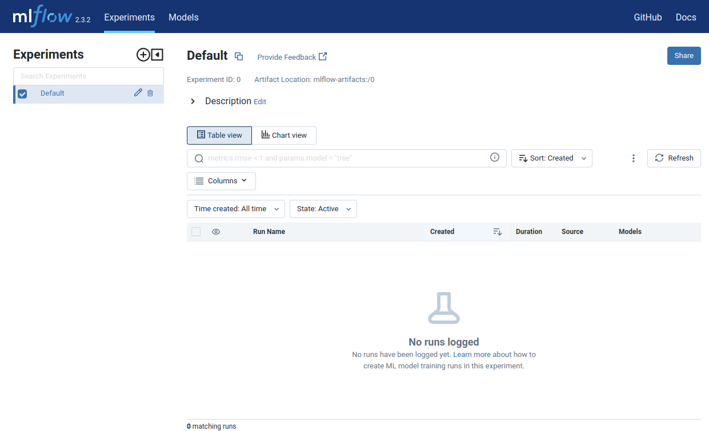
    <figcaption align="center"><b>Figure 1.</b> The MLflow User Interface</figcaption>
</p>

Create a new experiment by clicking on the plus sign on the upper left and filling out the dialogue window:
<p align="center">
    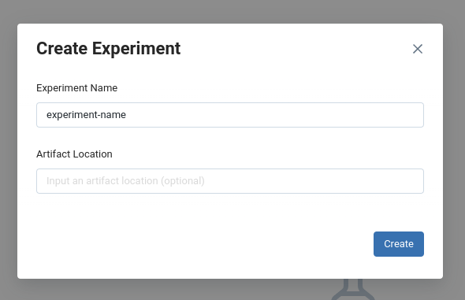
    <figcaption align="center"><b>Figure 2.</b> Creating a new (empty) experiment</figcaption>
</p>

- When experiments are conducted, the results will show where currently the text "No runs logged" is.
- You can specify which columns to use for logging by checking them when clicking the `columns` button

**Looking at models**
<div style="display: flex; justify-content: center;">
    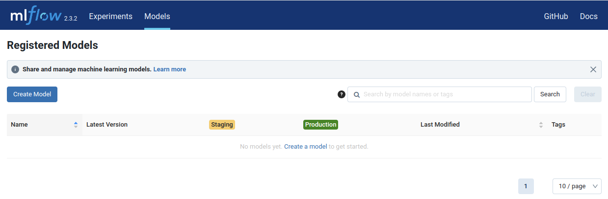
    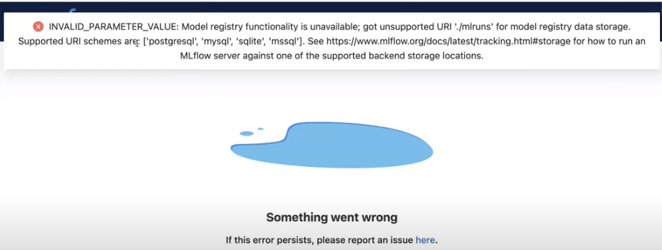
</div>
On the left you can see an empty list of registered models from the freshly created experiment. On the right you can see an error that is caused by not having one of the listed databased installed as a backend for MLflow.


## 2.2 Getting started with MLflow

This part show how to set up and run experiments with MLflow.

### Create MLflow conda-environment
```sh
conda create -n exp-tracking-env python=3.9 pip
```
The `pip` at the end is sometimes required when working on AWS, when `python3-pip` is not installed on the EC2-Instance. On your home computer you most probably have pip already installed, however it is advised to specify it at the creation of a new environment.

### Installing requiements (from file)
Install all dependencies from [mlflow_requirements.txt](mlflow_requirements.txt) with 
```sh
pip install -r mlflow_requirements.txt
```
<u>List of required packages</u>
```bash
mlflow
jupyter
scikit-learn
pandas
seaborn
hyperopt
xgboost
```

### Running MLflow and opening the UI

#### **`Running MLflow locally`**
When running the UI locally you can proceed as seen before:
```sh
mlflow ui [-parameters]
```

#### **`Accessing UI when running MLflow on AWS`**

1. Start the MLflow UI
    ```sh
    # will show http://127.0.0.1:5000
    mlflow ui [-parameters]
    ```
2. New ssh-connection with port forwarding
    ```sh
    ssh -L 5000:localhost:5000 <aws-ec2-name>
    ```
3. You can now open the MLflow UI on your local machine at: `http://127.0.0.1:5000`

#### **`Explicitely specifying a Database-Backend`**

Choosing a specific database type to save the results of experiments to (here: `sqlite`-database)
```sh
mlflow ui --backend-store-uri sqlite:///mlflow.db
```
When clicking on the `models`-tab in the MLflow UI you should not get an error now.

#### **`Importing and using MLflow`**
First thing to do is to import MLflow and set the tracking URI, s.t. MLflow writes to it. You also need to specify a experiment name. All runs are now assigned the specified experiment.
```python
import mlflow
mlflow.set_tracking_uri("sqlite:///mlflow.db")
# experiment will be created if not already existing
mlflow.set_experiment("my-experiment")
```
You should be able to see the experiment in the MLflow UI. Now you should be able to run you code, that uses the MLflow methodology and see the results from code like this:
```python
# Set everything inside a mlflow-run
with mlflow.start_run():

    # Setting tags/metadata
    mlflow.set_tag("developer", "johannes")
    # log data about the dataset
    mlflow.log_param("train-data-path", "./data/yellow_tripdata_2022-01.parquet")
    mlflow.log_param("valid-data-path", "./data/yellow_tripdata_2022-02.parquet")

    alpha = 0.01
    # logging the alpha parameter
    mlflow.log_param("alpha", alpha)

    lr = Lasso(alpha)
    lr.fit(X_train, y_train)
    
    y_pred = lr.predict(X_val)
    rmse = mean_squared_error(y_val, y_pred, squared=False)
    # Log metric
    mlflow.log_metric("rmse", rmse)
```
The [code](duration-prediction.ipynb) is from the chapter 2 version of the re-occuring notebook.

## 2.3 Experiment tracking with MLflow
After this section you should be able to:
- Add paramter tuning to the notebook
- See the results in MLflow UI
- Choose the best performing models
- Use Autolog

### Hyperparameter tuning with `hyperopt` using a `xgboost`-model

1. Importing the relevant packages
```python
import xgboost as xgb

from hyperopt import fmin, tpe, hp, STATUS_OK, Trials
from hyperopt.pyll import scope
```
- **`hyperopt`**-imports here:
    - `fmin`: for finding minimum output of a function
    - `tpe (Tree Parzen Estimators)`: Graphical model (GM)-based optimization algorithm using Theano
    - `hp`: Contains a bunch of methods to control the search-space for (each) hyperparameter
    - `STATUS_OK`: "Signal" that is sent, if a run of hpyerparameter optimization has concluded successfully
    - `Trials`: keeps track of the informations of each run
- **`hyperopt.pyll`**-imports here:
    - [`scope`](https://hyperopt.github.io/hyperopt/getting-started/search_spaces/): creates a range (search-scope) of integer values 


**Defining the machine learning model and its objective to use for hyperparameter optimization**
```python
def objective(params):
    with mlflow.start_run():
        mlflow.set_tag("model", "xgboost")
        mlflow.log_params(params)
        booster = xgb.train(
            params=params,
            dtrain=train,
            num_boost_round=1000,
            evals=[(valid, 'validation')],
            early_stopping_rounds=50
        )
        y_pred = booster.predict(valid)
        rmse = mean_squared_error(y_val, y_pred, squared=False)
        mlflow.log_metric("rmse", rmse)
    
    return { "loss": rmse, "status": STATUS_OK }
```
**Defining the search-spaces for hyperparameter optimization**

For more information about defining search-spaces, look at the documentation-page [Defining a Search Space](https://hyperopt.github.io/hyperopt/getting-started/search_spaces/).

```python
search_space = {
    "max_depth": scope.int(hp.quniform("max_depth", 4, 100, 1)),  # [4, 100]
    "learning_rate": hp.loguniform("learning_rate", -3, 0),       # [exp(-3),  exp(0)] <~> [0.05, 1]
    "reg_alpha": hp.loguniform("reg_alpha", -5, -1),              # [exp(-5), exp(-1)] <~> [0.0067, 0.367]
    "reg_lambda": hp.loguniform("reg_lambda", -6, -1),            # [exp(-6), exp(-1)] <~> [0.0025, 0.367]
    "min_child_weight": hp.loguniform("min_child_weight", -1, 3), # [exp(-1),  exp(3)] <~> [0.367, 20.09]
    "objective": "reg:linear",
    "seed": 42
}
```

Run the hyperparameter optimization process (this can take quite some time)
```python
best_result = fmin(
    fn=objective,
    space=search_space,
    algo=tpe.suggest,
    max_evals=50,
    trials=Trials()
)
```

**Looking at results**

Go to the MLflow UI and choose all runs, you have done during the current traning process. Then click on the compare button. You will get a visual representation of the results, that looks like this:
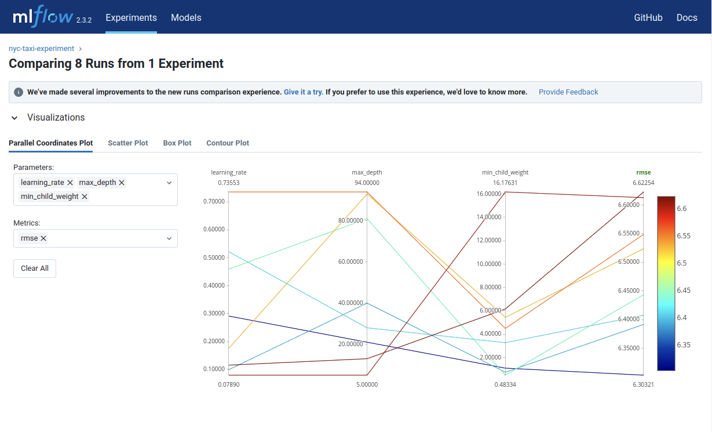
You are able to choose certain ranges of values on the lines below each parameter. With this, filtering of parameters that lie in certain ranges can be explored. 
You can also choose other visualization methods for the results. 

### Choosing the best model
After conclusion of the optimization-process, you go the MLflow UI and filter for the model with the best RMSE-value.
- (Quick and dirty way) Copy the parameters from the specified run into a notebook and put them into a dictionary of parameters
- Copy the model-definition, used in the objective function, and use the parameters for training.

**`Parameters`**
| **Name**             | **Value**              | 
| ---------------- | ------------------ |
| `learning_rate`	   | 0.2907320120988654 | 
| `max_depth`        | 21                 | 
| `min_child_weight` | 1.0853986931084512 | 
| `objective`	       | reg:linear         |
| `reg_alpha`        | 0.07070755159719935|
| `reg_lambda`	   |0.015498739698424788|
| `seed`	           | 42                 |
| **Metric** |  |
| `RMSE`   |  6.303    |

### Train and and save the model with the obtained parameters

- The model is again logged with `MLflow`.
- Now using [`mlflow.autolog()`](https://mlflow.org/docs/latest/tracking.html#automatic-logging)
    - `autolog`: allows to log a lot of information very fast, given you use a ml-framework that is supported by mlflow

```python
params = {
    "learning_rate": 0.2907320120988654,
    "max_depth": 21,
    "min_child_weight": 1.0853986931084512,
    "objective": "reg:linear",
    "reg_alpha": 0.07070755159719935,
    "reg_lambda": 0.015498739698424788,
    "seed": 42,
}

# Using autolog for logging with just 1 line of code
mlflow.xgboost.autolog()

booster = xgb.train(
    params=params,
    dtrain=train,
    num_boost_round=1000,
    evals=[(valid, 'validation')],
    early_stopping_rounds=50
)
```
You can see in the `MLflow` UI, that there were also some *artifacts* generated during the autologging process. Those artifacts contain the model as an `MLflow-Model` aswell as the feature importance of the model-weights.

### Summary
- How to tune Hyperparameter of an `XGBoost`-model with `hyperopt` 
- How to select the best model with `MLflow` and find *good* areas in the space of the hyperparameters

## 2.4 Model management

### Machine Learning Lifecycle

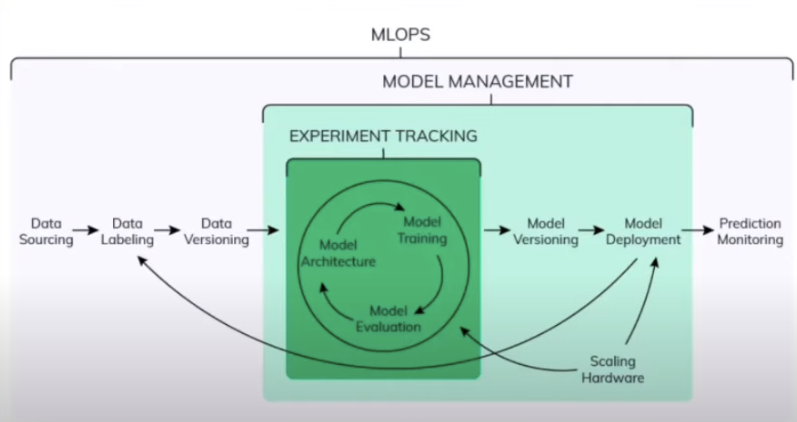

- **`Model-Management as Subset of ML Lifecycle`**
    - Experiment Tracking (with MLflow)
    - Model Versioning
    - Model Deployment
    - Scaling of Hardware

### Model Management
- **`Models located in Folders (bad)`**
    - Error prone 
    - no versioning
    - no model lineage

### Model Management in MLflow (1. Way)
- Tracking the model as an artifact
```python
# Set everything inside a mlflow-run
with mlflow.start_run():

    ... 

    # Log metric
    mlflow.log_metric("rmse", rmse)

    # saves artifact to local disk and creates an artifact uri in the current run
    mlflow.log_artifact(local_path="./models/lin_reg.bin", artifact_path="models_pickle")
```

### Model Management in MLflow (2. Way)

- Call model logging function for a specific ml-package

```python
with mlflow.start_run():
    best_params = {
        "learning_rate": 0.2907320120988654,
        "max_depth": 21,
        "min_child_weight": 1.0853986931084512,
        "objective": "reg:linear",
        "reg_alpha": 0.07070755159719935,
        "reg_lambda": 0.015498739698424788,
        "seed": 42,
    }

    mlflow.log_params(best_params)

    booster = xgb.train(
        params=params,
        dtrain=train,
        num_boost_round=1000,
        evals=[(valid, 'validation')],
        early_stopping_rounds=50
    )

    y_pred = booster.predict(valid)
    rmse = mean_squared_error(y_val, y_pred, squared=False)
    mlflow.log_metric("rmse", rmse)

    # ml-framework specific model-logging function
    mlflow.xgboost.log_model(booster, artifact_path="models_mlflow")
```

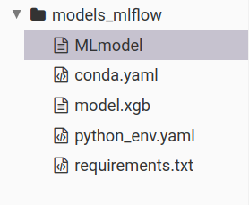
- The output of the model-logging function are 
    - `MLmodel`: Mlflow-model information
    - `conda.yaml`: Information about conda environment in which model was run in
    - `model.xgb`: Package-specific model-format (*here*: `xgb`)
    - `requirements.txt`: Information about virtual environment in which model was run in
    - `python_env.yaml`: Information about conda environment in which model was run in (only basic packages)

### Saving the preprocessor (as a binary file / artifact)

```python
# Disable autologging
mlflow.xgboost.autolog(disable=True)

with mlflow.start_run():

    ...

    # saving the preprocessor-object that is used before using the data in ml-tasks
    with open("models/preprocessor.b", "wb") as f_out:
        pickle.dump(dv, f_out)

    # save the data-preprocessor
    mlflow.log_artifact("models/preprocessor.b", artifact_path="preprocessor")

    mlflow.xgboost.log_model(booster, artifact_path="models_mlflow")
```

### Using a saved model to make predictions
This section is also shown with the logged artifacts in the mlflow ui

- `logged_model`: unique uri for the model
    - Format: run / run-id / models-mlflow

**Predict on a Spark DataFrame:**
```python

import mlflow
from pyspark.sql.functions import struct, col
logged_model = 'runs:/a8beaa704725443db702c63ffc026972/models_mlflow'

# Load model as a Spark UDF. Override result_type if the model does not return double values.
loaded_model = mlflow.pyfunc.spark_udf(spark, model_uri=logged_model, result_type='double')

# Predict on a Spark DataFrame.
df.withColumn('predictions', loaded_model(struct(*map(col, df.columns))))
```

**Predict on a Pandas DataFrame:**
```python
import mlflow
logged_model = 'runs:/a8beaa704725443db702c63ffc026972/models_mlflow'

# Load model as a PyFuncModel.
loaded_model = mlflow.pyfunc.load_model(logged_model)

# Predict on a Pandas DataFrame.
import pandas as pd
loaded_model.predict(pd.DataFrame(data))
```

**Example with XGBoost-Model**
```python
logged_model = "runs:/a8beaa704725443db702c63ffc026972/models_mlflow"

### Load model as PyFuncModel ###

loaded_model = mlflow.pyfunc.load_model(logged_model)
print(loaded_model)
# Output:
# mlflow.pyfunc.loaded_model:
#  artifact_path: models_mlflow
#  flavor: mlflow.xgboost
#  run_id: a8beaa704725443db702c63ffc026972

### Loading the model as an xgboost function ###

xgboost_model = mlflow.xgboost.load_model(logged_model)
print(xgboost_model)
# Output:
# <xgboost.core.Booster at 0x7f1df82752b0>

# Now you also can access all the methods of the xgboost-object
y_pred = xgboost_model.predict(valid)
print(y_pred[:10])
```

### Summary

- **`Logging models in MLflow (2 Options)`**
    - <u>Log model as an artifact</u>
    ```python
    mlflow.log_artifact("mymodel", artifact_path="models")
    ```
    - <u>Log model using the method `log_model`</u>
    ```python
    mlflow.<framework>.log_model(model, artifact_path="models")
    ```
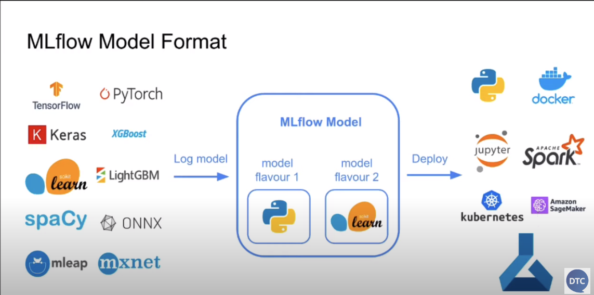


## 2.5 Model registry

<p align="center">
    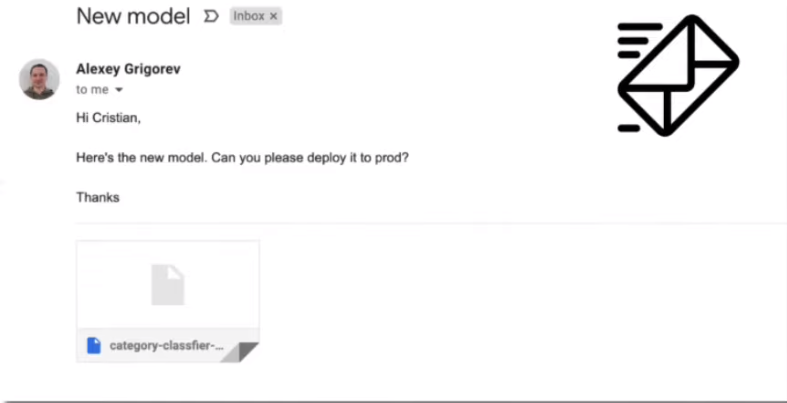
    <figcaption align="center">Deploy pls! What do?</figcaption>
</p>

### Motivation
- If a coworker sends you a model, you dont know much about it
    - What was the code used for training?
    - Is preprocessing required?
    - Hyperparameters? Dataset?
    - ...
- This should all be stored inside a tool for experiment tracking.
- A `Model Registry` would make this easier

### Model Registry
- `Tracking Server` for tracking model training and execution inside `runs`
- If you decide that some of the model are ready for production, register them in the `Model Registry`
    - Deployment engineers will look there for models to use

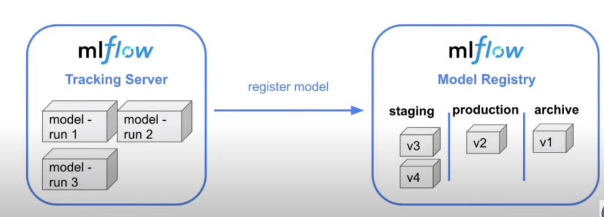

- Models can switch categories inisde the model registry, s.t. an archived model can be moved to production again
- `Model Registry` alone cant deploy (only labeling), and requires some CI/CD code to do the actual deployment

### Model Analysis
- What do you have to look at when deciding what model to deploy?
    - Metrics
    - Time to train
    - Model size

After choosing, you have to click on the button on the upper right
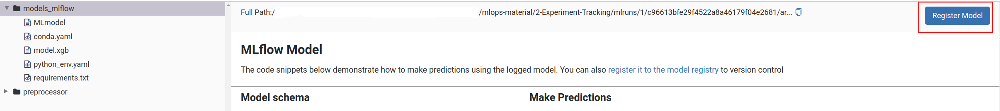

#### Registering 2 different models
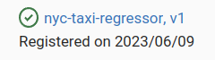
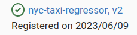
The second model (registered also as `nyc-taxi-regressor`) has the version 2.

#### Looking into the Model Registry (Model Tab)
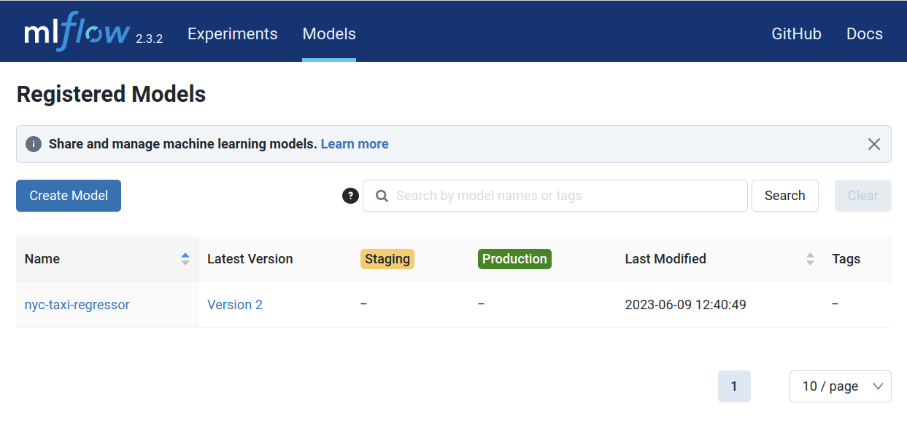

#### Staging a Model
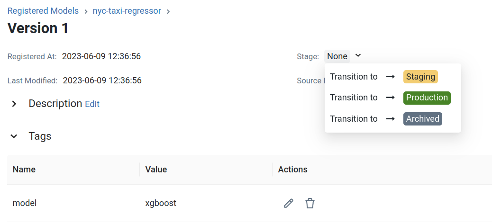

### Using Model Registry inside of Jupyter Notebook

**See here**: [model-registry.ipynb](./model-registry.ipynb)

### **`MlflowClient`** Class
- A client of ...
    - an *MLflow* Tracking Server that creates and manages experiments and runs
    - an *MLflow* Registry Server that creates and manages registered models and model versions.
- To instantiate it, we pass a tracking URI and/or registry URI:
```python
from mlflow.tracking import MlflowClient
client = MlflowClient(tracking_uri="sqlite:///mlflow.db")
```

### Model management in MLflow
- *Model Registry* is
    - Centralized model store
    - Set of API's
    - an UI

These tools can be used to manage the full lifecycle of an MLflow Model.

It provides:
- Model lineage
- Model versioning
- Stage transitions
- Annotations

## 2.6 MLflow in practice


## 2.7 MLflow: benefits, limitations and alternatives

### Different Scenarios for running MLflow
- <u>Lets consider 3 scenarios:</u>
    - Single Data Scientist, participating in a ML competition
    - Cross-functional team with one Data Scientist working on an ML model
    - Multiple Data Scientists working on multiple ML models

### Configuring MLflow
- **Backend Store** (saves all information from the runs)
    - local filesystem (if nothing specified)
    - SQLAlchemy compatible DB (e.g. SQLite)
- **Artifact Store**
    - local filesystem (if nothing specified)
    - remote (e.g. s3 bucket)
- **Tracking Server**
    - no tracking server
    - localhost
    - remote

### Examples for the 3 scenarios
For mor information look into the 3 notebooks:
- Scenario 1: [scenario-1](running-mlflow-examples/scenario-1.ipynb)
- Scenario 2: [scenario-2](running-mlflow-examples/scenario-2.ipynb)
- Scenario 3: [scenario-1](running-mlflow-examples/scenario-3.ipynb)


## 2.7 Homework

- [MLflow-Homework](homework/homework.md)
- [wandb-Homework](homework/wandb.md)