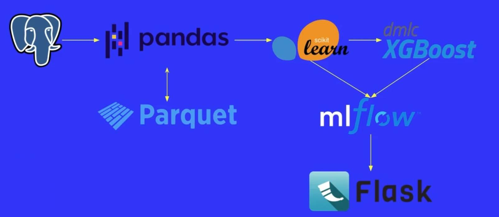
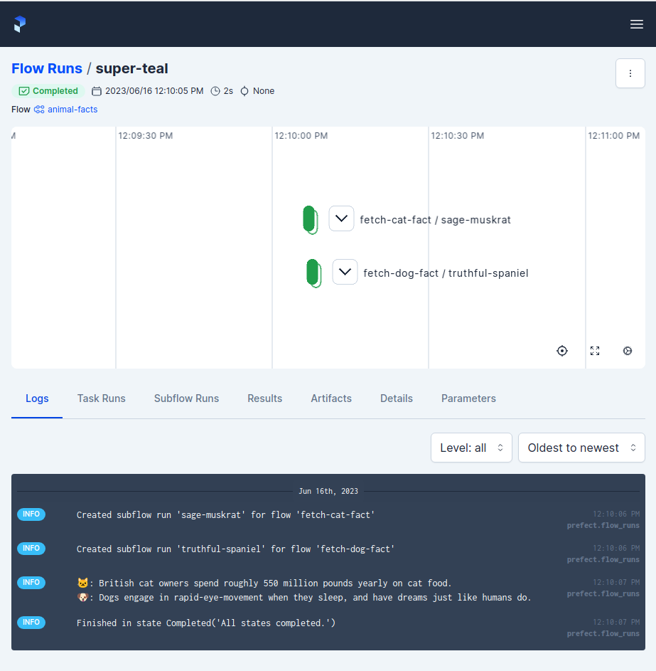
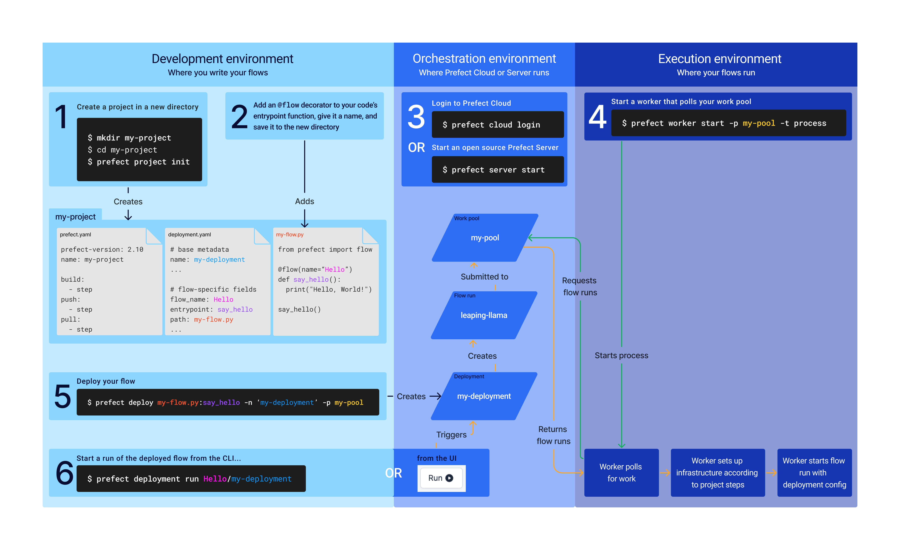
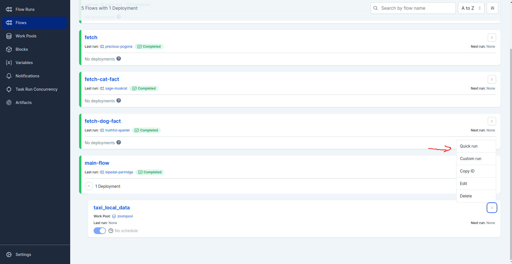
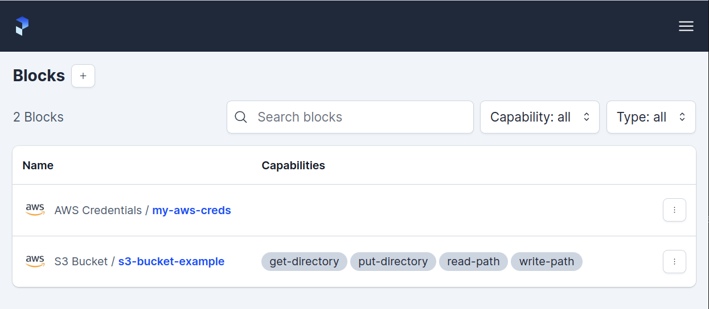
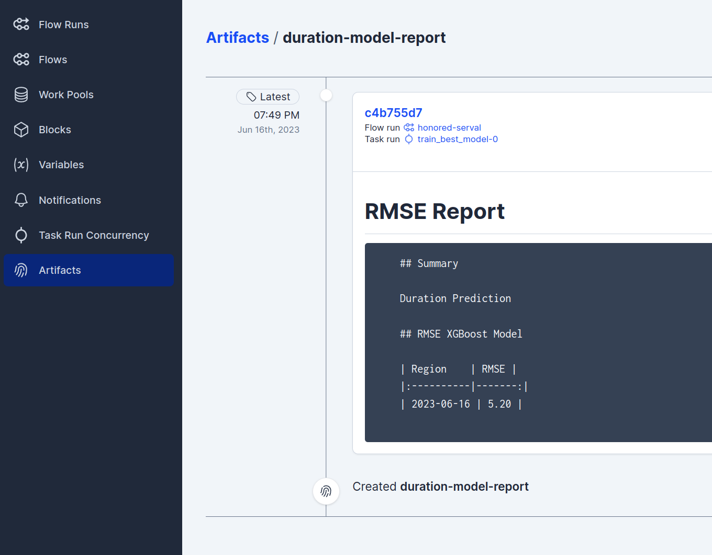

# 3. Orchestration and ML Pipelines

- **`Prefect-Website`**: [docs.prefect.io](https://docs.prefect.io/latest/)

## 3.1 Introduction to Workflow Orchestration



- Getting Data from `PostgreSQL`
- Handling the data as `Pandas` dataframe
- Maybe saving the data to a `Parquet` file to use later
- Maybe use `scikit-learn` for feature engineering or running models
- `XGBoost` for running a model
- `MLflow` for experiment tracking
- Using `Flask` for serving the model

There could be failure-points at every connection.

### If you give an MLOps engineer a job...
- Could you set up this pipeline to train this model?
- Could you set up logging?
- Could you do it every day?
- Could you make it retry if it fails?
- Could you send me a messae when it succeeds?
- Could you visualize the dependencies?
- Could you add some caching?
    - With unchanged inputs, we could save some time with this (is however tricky).
- Could you add collaborators to run ad hoc - who don't code?

Those tasks require a lot of work to do and work properly. You could also do everything in `Prefect`.

### Orchestrate & observe your Python workflows ar scale
- `Prefect` providwes tools for working with complex systems, so you can stop wondering about your workflows.
- Learn how to use Prefect to orchestrate and observe your ML workflows

## 3.2. Introduction to Prefect

### Goals of this Section
- Clone Github-Repo
- Setup *Conda*-Environment
- Start `Prefect` server
- Run a Prefect flow
- Checkout Prefect UI

### Why use Prefect?
- Flexible, open-source Python framework to turn standard pipelines into fault tolerant dataflows.
- Installing (on Linux) with `pip install -U prefect`
- For installation on other OS's please look into the [Installation Docs](https://docs.prefect.io/2.10.14/getting-started/installation/).

### Self-Hosting a Prefect Server
- [Info-Page](https://docs.prefect.io/latest/host/)
- **Orchestration API (REST)**: used by server to work with workflow metadata
- **Database**: stores workflow metadata
- **UI**: visualizes workflows

### Terminology
- **Task**: A discrete unit of work in a Prefect Workflow.
- **Flow**: Container for workflow logic.

```python
from prefect import task, flow

@task
def print_plus_one(obj):
    print(f"Received a {type(obj)} with value {obj}")
    # Shows the type of the parameter after coercion
    print(obj + 1)  # Adds one


# Note that we define the flow with type hints
@flow
def validation_flow(x: int, y: int):
    print_plus_one(x)
    print_plus_one(y)

if __name__ == "__main__":
    validation_flow(1, 2)
```

- **Subflow**: Flow called by another flow

```python
from prefect import task, flow

@task(name="Print Hello")
def print_hello(name):
    msg = f"Hello {name}!"
    print(msg)
    return msg

@flow(name="Subflow")
def my_subflow(msg):
    print(f"Subflow says: {msg}")

@flow(name="Hello Flow")
def hello_world(name="world"):
    message = print_hello(name)
    my_subflow(message)

hello_world("Marvin")
```
The names in the decorators are use in the Prefec UI for visualization.

### Example
1. Get the Repo
```shell
git clone https://github.com/discdiver/prefect-mlops-zoomcamp
```
2. Create a conda environment
```shell
conda create -n prefect-ops python=3.9.12
```
3. Install the required dependencies
```shell
pip install -r requirements.txt
```
4. Start a `Prefect`-Server
```shell
prefect server start
```
5. Configure Prefect to communicate with the server with
```shell
prefect config set PREFECT_API_URL=http://127.0.0.1:4200/api
```
6. Go to the 3.2 sub-folder in the repo, that was previously cloned
7. Open the file `cat_facts.py`, to learn the real facts about cats!
```python
import httpx
from prefect import flow, task

@task(retries=4, retry_delay_seconds=0.1, log_prints=True)
def fetch_cat_fact():
    cat_fact = httpx.get("https://f3-vyx5c2hfpq-ue.a.run.app/")
    #An endpoint that is designed to fail sporadically
    if cat_fact.status_code >= 400:
        raise Exception()
    print(cat_fact.text)

@flow
def fetch():
    fetch_cat_fact()


if __name__ == "__main__":
    fetch()
```
- `@task` decorator of `fetch_cat_fact`:
    - retries the task up to 4 times (in case of failure)
    - time between each try is 0.1 seconds
    - logs all print statements during the task


8. Look into the UI and see what was saved.
9. Now open `cat_dog_facts.py`. This python file shows how subflows are utilized.
```python
import httpx
from prefect import flow

@flow
def fetch_cat_fact():
    '''A flow that gets a cat fact'''
    return httpx.get("https://catfact.ninja/fact?max_length=140").json()["fact"]

@flow
def fetch_dog_fact():
    '''A flow that gets a dog fact'''
    return httpx.get(
        "https://dogapi.dog/api/v2/facts",
        headers={"accept": "application/json"},
    ).json()["data"][0]["attributes"]["body"]

@flow(log_prints=True)
def animal_facts():
    cat_fact = fetch_cat_fact()
    dog_fact = fetch_dog_fact()
    print(f"🐱: {cat_fact} \n🐶: {dog_fact}")

if __name__ == "__main__":
    animal_facts()
```
- `animal_facts` is the main-flow
    - `fetch_cat_fact` and `fetch_dog_fact` are sub-flows

10. Run `cat_dog_facts.py` (to expand your knowledge about feline mammals) and to see the results in the prefect UI. Lets see them flows!



## 3.3 Prefect Workflow

-  In  the cloned repository open the file `orchestrate_pre_prefect.py` (in sub-folder `3.3`) to see a workflow without prefect.

The data-files used are also in the repository, but they could be from another year, that is not in the default-parameters of the main-function. You have to add the new paths yourself.

- Now open `orchestrate.py` from the same folder `3.3`. This file has the adequate `prefect`-decorators
```python
# retries opening 3 times + delay for when data is obtained from the internet
@task(retries=3, retry_delay_seconds=2)
def read_data(filename: str) -> pd.DataFrame:
    ...

# simple task with no additional parameters
@task
def add_features(
        df_train: pd.DataFrame, df_val: pd.DataFrame
):
    ...

# logs all console outputs
@task(print_logs=True)
def train_best_model(...):
    ...
```
- Run the programm and go to the UI and see the results.

## 3.4 Deploying your Workflow
- Productionizing the workflow
- Deploy on prefect-server (for now locally)
- Allows scheduling and cooperation (wehen running on prefect-cloud)

Go to the folder `3.4` of the cloned repo and use the following command
```shell
prefect project init
```
This will cereate 3 files and 1 folder:
- `.prefectignore`: Gitignore-like file
- `deployment.yaml`: Important for templating, when you want to make multiple deployments from one project.
- `.prefect/`: a hidden folder
- `prefect.yaml`: See code below!
```yaml
# File for configuring project / deployment build, push and pull steps

# Generic metadata about this project
name: '3.4'
prefect-version: 2.10.8

# build section allows you to manage and build docker images
build: null

# push section allows you to manage if and how this project is uploaded to remote locations
push: null

# pull section allows you to provide instructions for cloning this project in remote locations
pull:
- prefect.projects.steps.git_clone_project:
    repository: https://github.com/discdiver/prefect-mlops-zoomcamp
    branch: main
    access_token: null

```
### Create, run and deploy

<p align="center">
    
    <figcaption align="center">Think it, dream it, do it!</figcaption>
</p>

<!--  -->

1. **Create a project in a new directory**
    - Already present
2. **Add adequate @flow decorators to your code**
    - Already present in the code (see cloned repo)
3. **Starting the Prefect Server**
    - For now done locally with
    ```shell
    prefect server start
    ```
    - Create a `workpool` to work in
        - Can be done with the UI or with the CLI
            - UI: click on `workpools`-tab, set a name and decription and the type (+ some other parameters if required)
        - Can be created locally or on the cloud (specified with `type`-parameter)
        - After creating the `workpool` you can reference it when running prefect
5. **Deploy the prefect flow**
    - Get help with `prefect deploy --help`
    - We need to specify an entrypoint for the project. This has the format: 
        - `./path/to/file.py:flow_function`
        - *Example*:
        ```shell
        # name: taxi1, workpool: zoompool
        prefect deploy orchestrate.py:main_flow -n taxi_local_data -p zoompool
        ```
4. **Deploy the worker that polls the workpool**
-   ```shell
    prefect worker start -p zoompool
    ```
- If the pool did not exist alread you could use the parameter `-t [pool-type]` to create one on the fly and the parameter `-p [poolname]` is used to name it
-   ```shell
    # Example
    prefect worker start -p zoompool -t process
    ```

6. **Run the deployment**



## 3.5 Working with Deployments
- In this section the connection with AWS S3 Buckets is shown
- You need to install the `aws`-version of `prefect` to use the required functionality
```shell
# Simple as!
pip install prefect-aws
```
- To look into the documentation for `prefect-aws` please look into the Documentation [here](https://prefecthq.github.io/prefect-aws/).
- Go to your AWS account and create a new `S3 Bucket` for this task. The bucket is access-blocked by default.
    - If you dont already have a `IAM-User` with S3 access, please create one
    - When the IAM user is created, you can create Access keys
    - The generated access keys can now be used in the code of `create_s3_bucket_block.py`.

```python
import os
from time import sleep
from prefect_aws import S3Bucket, AwsCredentials

## IMPORTANT: Dont hardcode the credentials in the program
##            Rather use environment variables.
AWS_ACCESS_KEY_ID = os.environ['AWS_ACCESS_KEY_ID']
AWS_SECRET_ACCESS_KEY = os.environ['AWS_SECRET_ACCESS_KEY']

def create_aws_creds_block():
    my_aws_creds_obj = AwsCredentials(
        aws_access_key_id=AWS_ACCESS_KEY_ID, 
        aws_secret_access_key=AWS_SECRET_ACCESS_KEY
    )
    my_aws_creds_obj.save(name="my-aws-creds", overwrite=True)

def create_s3_bucket_block():
    aws_creds = AwsCredentials.load("my-aws-creds")
    my_s3_bucket_obj = S3Bucket(
        bucket_name="zoomcamp-mlops-prefect-bucket", credentials=aws_creds
    )
    my_s3_bucket_obj.save(name="s3-bucket-example", overwrite=True)


if __name__ == "__main__":
    create_aws_creds_block()
    sleep(5)
    create_s3_bucket_block()
```

When everythin is setup you can call the following code to create the credentials and the bucket block:
```shell
python3 3.5/create_s3_bucket_block.py
```

The resulting blocks can be seen here:



To see all current blocks with the command line you have to call the following command:
```shell
# List all blocks
prefect blocks ls
# List Block Types that are available
prefect block type ls
```
To be able to use created blocks and send them to the server, you have to register them. This tells the server that all the blocks are available.
```shell
prefect block register -m prefect_aws

# Console Output:
Successfully registered 5 blocks

┏━━━━━━━━━━━━━━━━━━━┓
┃ Registered Blocks ┃
┡━━━━━━━━━━━━━━━━━━━┩
│ AWS Credentials   │
│ AWS Secret        │
│ ECS Task          │
│ MinIO Credentials │
│ S3 Bucket         │
└───────────────────┘

 To configure the newly registered blocks, go to the 
Blocks page in the Prefect UI: 
http://127.0.0.1:4200/blocks/catalog
```
The server now knows that those 5 types of blocks exist. If you go to the prefect server and want to add a new block, go to the `blocks`-tab and add the blocks you like.

### Creating an Artifact

The code can be fonud here: [orchestrate_s3.py](https://github.com/discdiver/prefect-mlops-zoomcamp/blob/main/3.5/orchestrate_s3.py)
Changes in comparison to `orchestrate.py`, which works locally:
- Accesses the data from an S3 bucket
  ```python
  # Additional imports
  from prefect_aws import S3Bucket
  from prefect.artifacts import create_markdown_artifact
  ...

  # In train_best_model(...)
  markdown__rmse_report = f"""# RMSE Report

  ## Summary

  Duration Prediction 

  ## RMSE XGBoost Model

  | Region    | RMSE |
  |:----------|-------:|
  | {date.today()} | {rmse:.2f} |
  """

  create_markdown_artifact(
      key="duration-model-report", markdown=markdown__rmse_report
  )

  ... 
  # Load in main_flow_s3(...)
  s3_bucket_block = S3Bucket.load("s3-bucket-block")
  s3_bucket_block.download_folder_to_path(from_folder="data", to_folder="data")
  ```
  - This will download the requested data from the S3 bucket and place it in the `data` folder.
  - Now the model will be trained and the artifacts will be generated
  

### Creating and deploying S3 file with markdown artifact
- Go to the deployment.yaml file in the main-directory of the cloned github-repo
```yaml
# deployment.yaml
deployments:
- name: taxi_local_data
  entrypoint: 3.4/orchestrate.py:main_flow
  work_pool: 
    name: zoompool
- name: taxi_s3_data
  entrypoint: 3.5/orchestrate_s3.py:main_flow_s3
  work_pool: 
    name: zoompool
```
- This file contains 2 different deployments, that rould be run
    - To run all deployments use
    ```shell
    prefect deploy --all
    ```
    - To run a single deployment use
    ```shell
    prefect deploy -n <deployment-name>
    ```
- The rendered Markdown

```markdown
## Summary

Duration Prediction 

## RMSE XGBoost Model

| Region    | RMSE |
|:----------|-------:|
| 2023-06-16 | 5.20 |
```

## 3.6 - Prefect Cloud (Optional)

TODO