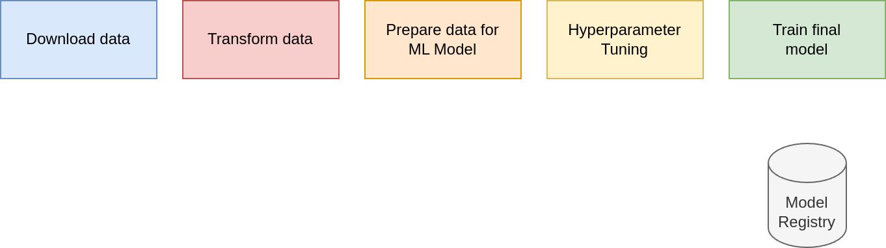
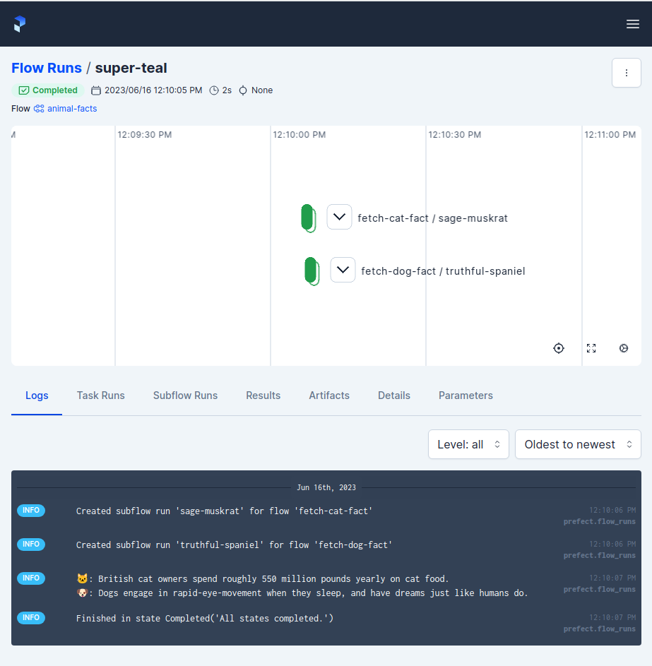

# 3. Orchestration and ML Pipelines (Prefect 3)

- [3. Orchestration and ML Pipelines (Prefect 3)](#3-orchestration-and-ml-pipelines-prefect-3)
  - [Machine Learning (ML) Pipelines](#machine-learning-ml-pipelines)
  - [3.1 Introduction to Workflow Orchestration](#31-introduction-to-workflow-orchestration)
    - [If you give an MLOps engineer a job...](#if-you-give-an-mlops-engineer-a-job)
    - [Orchestrate \& observe your Python workflows at scale](#orchestrate--observe-your-python-workflows-at-scale)
  - [3.2. Introduction to Prefect 3](#32-introduction-to-prefect-3)
    - [Goals of this Section](#goals-of-this-section)
    - [Why use Prefect 3?](#why-use-prefect-3)
    - [Self-Hosting a Prefect Server](#self-hosting-a-prefect-server)
    - [Terminology](#terminology)
    - [Example](#example)
  - [3.3 Prefect Workflow](#33-prefect-workflow)
  - [3.4 Deploying your Workflow - Detailed Explanations](#34-deploying-your-workflow---detailed-explanations)
  - [3.5 Working with Deployments](#35-working-with-deployments)
    - [Working with External Storage (S3)](#working-with-external-storage-s3)
    - [Creating an Artifact](#creating-an-artifact)
    - [Deployment with Multiple Flows](#deployment-with-multiple-flows)
  - [3.6 - Prefect Cloud (Optional)](#36---prefect-cloud-optional)
    - [Key Differences in Prefect Cloud for Prefect 3:](#key-differences-in-prefect-cloud-for-prefect-3)
    - [Getting Started with Prefect Cloud:](#getting-started-with-prefect-cloud)
    - [Creating Cloud-based Work Pools:](#creating-cloud-based-work-pools)
    - [Using Automations (Prefect 3 feature):](#using-automations-prefect-3-feature)

## Machine Learning (ML) Pipelines



- Usually jupyter notebooks are good for prototyping and visualization of ML results but they are not that suitable in a continuous MLOps setting.
- Notebooks are often transformed to a script and used as a pipeline

**Example (Taxi Data) for a basic ML-Pipeline skeleton:**
```python
def download_data(year, month):
    ...
    return df

def prepare_data(df):
    ...
    return df

def feature_engineering(df):
    ...
    return X, y

def find_best_model(X, y):
    ...
    return params

def train_model(X, y, params):
    ...
    return model

def main():
    df = download_data(2023, 1)
    df = prepare_data(df)
    X, y = feature_engineering(df)
    model_params = find_best_model(X, y)
    model = train_model(X, y, model_params)
```

- **`Prefect-Website`**: [docs.prefect.io](https://docs.prefect.io/latest/)

## 3.1 Introduction to Workflow Orchestration


- Getting Data from `PostgreSQL`
- Handling the data as `Pandas` dataframe
- Maybe saving the data to a `Parquet` file to use later
- Maybe use `scikit-learn` for feature engineering or running models
- `XGBoost` for running a model
- `MLflow` for experiment tracking
- Using `Flask` for serving the model

There could be failure-points at every connection.

### If you give an MLOps engineer a job...
- Could you set up this pipeline to train this model?
- Could you set up logging?
- Could you do it every day?
- Could you make it retry if it fails?
- Could you send me a message when it succeeds?
- Could you visualize the dependencies?
- Could you add some caching?
    - With unchanged inputs, we could save some time with this (is however tricky).
- Could you add collaborators to run ad hoc - who don't code?

Those tasks require a lot of work to do and work properly. You could also do everything in `Prefect`.

### Orchestrate & observe your Python workflows at scale
- `Prefect 3` provides tools for working with complex systems, so you can stop wondering about your workflows.
- Learn how to use Prefect 3 to orchestrate and observe your ML workflows

## 3.2. Introduction to Prefect 3

### Goals of this Section
- Clone Github-Repo
- Setup *Conda*-Environment
- Start `Prefect` server
- Run a Prefect flow
- Checkout Prefect UI

### Why use Prefect 3?
- **Async-first architecture** for better performance
- **Simplified API** compared to Prefect 2
- Flexible, open-source Python framework to turn standard pipelines into fault tolerant dataflows
- Installing (on Linux) with `pip install -U "prefect>=3.0"`
- For installation on other OS's please look into the [Installation Docs](https://docs.prefect.io/latest/get-started/install/)

### Self-Hosting a Prefect Server
- [Info-Page](https://docs.prefect.io/latest/manage/self-host/)
- **Orchestration API (REST)**: used by server to work with workflow metadata
- **Database**: stores workflow metadata (PostgreSQL or SQLite)
- **UI**: visualizes workflows

### Terminology
- **Task**: A discrete unit of work in a Prefect Workflow
- **Flow**: Container for workflow logic
- **Worker**: Process that executes flow runs (replaces agents from Prefect 2)
- **Work Pool**: Manages work queues and worker configuration

```python
from prefect import task, flow

@task
def print_plus_one(obj):
    print(f"Received a {type(obj)} with value {obj}")
    print(obj + 1)
    return obj + 1

@flow
def validation_flow(x: int, y: int):
    # Tasks can be called directly in Prefect 3
    result1 = print_plus_one(x)
    result2 = print_plus_one(y)
    return result1, result2

if __name__ == "__main__":
    # Flows return results directly in Prefect 3
    results = validation_flow(1, 2)
    print(f"Results: {results}")
```

- **Subflow**: Flow called by another flow

```python
from prefect import task, flow

@task(name="Print Hello")
def print_hello(name):
    msg = f"Hello {name}!"
    print(msg)
    return msg

@flow(name="Subflow")
def my_subflow(msg):
    print(f"Subflow says: {msg}")
    return msg.upper()

@flow(name="Hello Flow")
def hello_world(name="world"):
    message = print_hello(name)
    # Subflows can return values in Prefect 3
    result = my_subflow(message)
    return result

if __name__ == "__main__":
    final_result = hello_world("Marvin")
    print(f"Final result: {final_result}")
```

### Example
1. Get the Repo
```shell
git clone https://github.com/joweyel/prefect-mlops-zoomcamp -b prefect3
cd prefect-mlops-zoomcamp
```

2. Create a conda environment
```shell
conda create -n prefect-ops3 python=3.11 pip
conda activate prefect-ops3
```

3. Install the required dependencies
```shell
pip install -r requirements.txt
```

4. Start a `Prefect`-Server
```shell
prefect server start
```

5. Configure Prefect to communicate with the server
```shell
prefect config set PREFECT_API_URL=http://127.0.0.1:4200/api
```

6. Go to the 3.2 sub-folder in the repo
7. Open the file `cat_facts.py`
```python
import httpx
from prefect import flow, task

@task(retries=4, retry_delay_seconds=1.0, log_prints=True)
def fetch_cat_fact():
    cat_fact = httpx.get("https://f3-vyx5c2hfpq-ue.a.run.app/")
    if cat_fact.status_code >= 400:
        raise Exception()
    print(cat_fact.text)
    return cat_fact.text

@flow
def fetch():
    # Task results are captured directly in Prefect 3
    fact = fetch_cat_fact()
    return fact

if __name__ == "__main__":
    result = fetch()
```

8. Look into the UI and see what was saved
9. Now open `cat_dog_facts.py`
```python
import httpx
from prefect import flow

@flow
def fetch_cat_fact():
    '''A flow that gets a cat fact'''
    return httpx.get("https://catfact.ninja/fact?max_length=140").json()["fact"]

@flow
def fetch_dog_fact():
    '''A flow that gets a dog fact'''
    return httpx.get(
        "https://dogapi.dog/api/v2/facts",
        headers={"accept": "application/json"},
    ).json()["data"][0]["attributes"]["body"]

@flow(log_prints=True)
def animal_facts():
    cat_fact = fetch_cat_fact()
    dog_fact = fetch_dog_fact()
    print(f"🐱: {cat_fact} \n🐶: {dog_fact}")
    return { "cat": cat_fact, "dog": dog_fact }

if __name__ == "__main__":
    facts = animal_facts()
```

10. Run `cat_dog_facts.py` and check the Prefect UI



## 3.3 Prefect Workflow

**Pipeline without Prefect**
- In the cloned repository open the file [`orchestrate_pre_prefect.py`](./prefect-mlops-zoomcamp/3.3/orchestrate_pre_prefect.py) (in sub-folder `3.3`)

<details>
<summary><b>orchestrate_pre_prefect.py</b></summary>

```python
import pathlib
import pickle
import pandas as pd
import numpy as np
import scipy
import sklearn
from sklearn.feature_extraction import DictVectorizer
from sklearn.metrics import mean_squared_error
import mlflow
from mlflow.models import infer_signature
import xgboost as xgb
from prefect import flow, task
from typing import Tuple


def read_data(filename: str) -> pd.DataFrame:
    """Read data into DataFrame"""
    df = pd.read_parquet(filename)

    df.lpep_dropoff_datetime = pd.to_datetime(df.lpep_dropoff_datetime)
    df.lpep_pickup_datetime = pd.to_datetime(df.lpep_pickup_datetime)

    df["duration"] = df.lpep_dropoff_datetime - df.lpep_pickup_datetime
    df.duration = df.duration.apply(lambda td: td.total_seconds() / 60)

    df = df[(df.duration >= 1) & (df.duration <= 60)]

    categorical = ["PULocationID", "DOLocationID"]
    df[categorical] = df[categorical].astype(str)

    return df


def add_features(
    df_train: pd.DataFrame, df_val: pd.DataFrame
) -> Tuple[
        scipy.sparse._csr.csr_matrix,
        scipy.sparse._csr.csr_matrix,
        np.ndarray,
        np.ndarray,
        sklearn.feature_extraction.DictVectorizer,
]:
    """Add features to the model"""
    df_train["PU_DO"] = df_train["PULocationID"] + "_" + df_train["DOLocationID"]
    df_val["PU_DO"] = df_val["PULocationID"] + "_" + df_val["DOLocationID"]

    categorical = ["PU_DO"]  #'PULocationID', 'DOLocationID']
    numerical = ["trip_distance"]

    dv = DictVectorizer()

    train_dicts = df_train[categorical + numerical].to_dict(orient="records")
    X_train = dv.fit_transform(train_dicts)

    val_dicts = df_val[categorical + numerical].to_dict(orient="records")
    X_val = dv.transform(val_dicts)

    y_train = df_train["duration"].values
    y_val = df_val["duration"].values
    return X_train, X_val, y_train, y_val, dv


def train_best_model(
    X_train: scipy.sparse._csr.csr_matrix,
    X_val: scipy.sparse._csr.csr_matrix,
    y_train: np.ndarray,
    y_val: np.ndarray,
    dv: sklearn.feature_extraction.DictVectorizer,
) -> None:
    """train a model with best hyperparams and write everything out"""

    with mlflow.start_run():
        train = xgb.DMatrix(X_train, label=y_train)
        valid = xgb.DMatrix(X_val, label=y_val)

        best_params = {
            "learning_rate": 0.09585355369315604,
            "max_depth": 30,
            "min_child_weight": 1.060597050922164,
            "objective": "reg:squarederror",
            "reg_alpha": 0.018060244040060163,
            "reg_lambda": 0.011658731377413597,
            "seed": 42,
        }

        mlflow.log_params(best_params)

        booster = xgb.train(
            params=best_params,
            dtrain=train,
            num_boost_round=100,
            evals=[(valid, "validation")],
            early_stopping_rounds=20,
        )

        y_pred = booster.predict(valid)
        rmse = np.sqrt(mean_squared_error(y_val, y_pred))
        mlflow.log_metric("rmse", rmse)

        pathlib.Path("models").mkdir(exist_ok=True)
        with open("models/preprocessor.b", "wb") as f_out:
            pickle.dump(dv, f_out)
        mlflow.log_artifact("models/preprocessor.b", artifact_path="preprocessor")

        # Infer signature using raw input features (before DMatrix conversion)
        signature = infer_signature(X_val.toarray(), y_val)
        mlflow.xgboost.log_model(booster, artifact_path="models_mlflow", signature=signature)
    return None


def main_flow(
    train_path: str = "./data/green_tripdata_2021-01.parquet",
    val_path: str = "./data/green_tripdata_2021-02.parquet",
) -> None:
    """The main training pipeline"""

    # MLflow settings
    mlflow.set_tracking_uri("sqlite:///mlflow.db")
    mlflow.set_experiment("nyc-taxi-experiment")

    # Load
    df_train = read_data(train_path)
    df_val = read_data(val_path)

    # Transform
    X_train, X_val, y_train, y_val, dv = add_features(df_train, df_val)

    # Train
    train_best_model(X_train, X_val, y_train, y_val, dv)


if __name__ == "__main__":
    # Updated file names for 2023
    train_path: str = "./data/green_tripdata_2023-01.parquet"
    val_path: str = "./data/green_tripdata_2023-02.parquet"
    main_flow(train_path, val_path)

```

</details>

- Run the pipeline: `python3 3.3/orchestrate_pre_prefect.py`

**Pipeline with Prefect 3**
- Open [`orchestrate.py`](prefect-mlops-zoomcamp/3.3/orchestrate.py) from folder `3.3`

<details>

<summary></summary>

```python
import pathlib
import pickle
import pandas as pd
import numpy as np
import scipy
import sklearn
from sklearn.feature_extraction import DictVectorizer
from sklearn.metrics import mean_squared_error
import mlflow
from mlflow.models import infer_signature
import xgboost as xgb
from prefect import flow, task
from typing import Tuple


@task(retries=3, retry_delay_seconds=2)
def read_data(filename: str) -> pd.DataFrame:
    """Read data into DataFrame"""
    df = pd.read_parquet(filename)

    df.lpep_dropoff_datetime = pd.to_datetime(df.lpep_dropoff_datetime)
    df.lpep_pickup_datetime = pd.to_datetime(df.lpep_pickup_datetime)

    df["duration"] = df.lpep_dropoff_datetime - df.lpep_pickup_datetime
    df.duration = df.duration.apply(lambda td: td.total_seconds() / 60)

    df = df[(df.duration >= 1) & (df.duration <= 60)]

    categorical = ["PULocationID", "DOLocationID"]
    df[categorical] = df[categorical].astype(str)

    return df


@task
def add_features(df_train: pd.DataFrame, df_val: pd.DataFrame) -> Tuple[
    scipy.sparse._csr.csr_matrix,
    scipy.sparse._csr.csr_matrix,
    np.ndarray,
    np.ndarray,
    sklearn.feature_extraction.DictVectorizer,
]:
    """Add features to the model"""
    df_train["PU_DO"] = df_train["PULocationID"] + "_" + df_train["DOLocationID"]
    df_val["PU_DO"] = df_val["PULocationID"] + "_" + df_val["DOLocationID"]

    categorical = ["PU_DO"]  #'PULocationID', 'DOLocationID']
    numerical = ["trip_distance"]

    dv = DictVectorizer()

    train_dicts = df_train[categorical + numerical].to_dict(orient="records")
    X_train = dv.fit_transform(train_dicts)

    val_dicts = df_val[categorical + numerical].to_dict(orient="records")
    X_val = dv.transform(val_dicts)

    y_train = df_train["duration"].values
    y_val = df_val["duration"].values
    return X_train, X_val, y_train, y_val, dv


@task(log_prints=True)
def train_best_model(
    X_train: scipy.sparse._csr.csr_matrix,
    X_val: scipy.sparse._csr.csr_matrix,
    y_train: np.ndarray,
    y_val: np.ndarray,
    dv: sklearn.feature_extraction.DictVectorizer,
) -> None:
    """train a model with best hyperparams and write everything out"""

    with mlflow.start_run():
        train = xgb.DMatrix(X_train, label=y_train)
        valid = xgb.DMatrix(X_val, label=y_val)

        best_params = {
            "learning_rate": 0.09585355369315604,
            "max_depth": 30,
            "min_child_weight": 1.060597050922164,
            "objective": "reg:squarederror",
            "reg_alpha": 0.018060244040060163,
            "reg_lambda": 0.011658731377413597,
            "seed": 42,
        }

        mlflow.log_params(best_params)

        booster = xgb.train(
            params=best_params,
            dtrain=train,
            num_boost_round=100,
            evals=[(valid, "validation")],
            early_stopping_rounds=20,
        )

        y_pred = booster.predict(valid)
        rmse = np.sqrt(mean_squared_error(y_val, y_pred))
        mlflow.log_metric("rmse", rmse)

        pathlib.Path("models").mkdir(exist_ok=True)
        with open("models/preprocessor.b", "wb") as f_out:
            pickle.dump(dv, f_out)
        mlflow.log_artifact("models/preprocessor.b", artifact_path="preprocessor")

        # Infer signature using raw input features (before DMatrix conversion)
        signature = infer_signature(X_val.toarray(), y_val)
        mlflow.xgboost.log_model(booster, artifact_path="models_mlflow", signature=signature)
    return None


@flow(name="main-flow")
def main_flow(
    train_path: str = "./data/green_tripdata_2021-01.parquet",
    val_path: str = "./data/green_tripdata_2021-02.parquet",
) -> None:
    """The main training pipeline"""

    # MLflow settings
    mlflow.set_tracking_uri("sqlite:///mlflow.db")
    mlflow.set_experiment("nyc-taxi-experiment")

    # Load
    df_train = read_data(train_path)
    df_val = read_data(val_path)

    # Transform
    X_train, X_val, y_train, y_val, dv = add_features(df_train, df_val)

    # Train
    train_best_model(X_train, X_val, y_train, y_val, dv)


if __name__ == "__main__":
    # Updated file names
    train_path: str = "./data/green_tripdata_2023-01.parquet"
    val_path: str = "./data/green_tripdata_2023-02.parquet"
    main_flow(train_path, val_path)
```

</details>
You're right, let me provide explanations for each point in section 3.4:

## 3.4 Deploying your Workflow - Detailed Explanations

1. **Ensure your directory is set up**
- Navigate to the `prefect-mlops-zoomcamp` directory - this is your project root
- Add `@flow` and `@task` decorators to your Python scripts - these decorators tell Prefect which functions to track and orchestrate. Without at least one `@flow`, you can't deploy

2. **Start the Prefect Server**
```shell
prefect server start
```
- Starts a local Prefect server on `http://127.0.0.1:4200`
- This server manages your flow runs, stores metadata, and provides the UI
- Keep this terminal window open while working

3. **Create a Work Pool**
```shell
prefect work-pool create zoompool -t process
```
- Work pools manage where and how your flows run
- `-t process` means flows run as local processes (good for development)
- Work pools queue deployments and workers pick them up

4. **Deploy the flow**
```shell
prefect deploy 3.4/orchestrate.py:main_flow \
    -n taxi_local_data \
    -p zoompool \
    --cron "0 0 * * *"
```
- `3.4/orchestrate.py:main_flow` - file path and function name of your flow
- `-n taxi_local_data` - deployment name (how you'll reference it)
- `-p zoompool` - which work pool to use
- `--cron "0 0 * * *"` - optional schedule (runs daily at midnight)

5. **Start a worker**
```shell
prefect worker start -p zoompool
```
- Workers poll work pools and execute deployments
- Must keep running to process flow runs
- One worker can handle multiple flows

6. **Run the deployment**
```shell
prefect deployment run 'main-flow/taxi_local_data' \
    --param train_path=./data/green_tripdata_2023-01.parquet \
    --param val_path=./data/green_tripdata_2023-02.parquet
```
- Triggers an immediate run (doesn't wait for schedule)
- Format: `'flow-name/deployment-name'`
- `--param` overrides default parameters

7. **Using prefect.yaml**
The `prefect.yaml` file lets you define multiple deployments declaratively:
- `variables`: Global values accessible across deployments
- `pull`: How to get your code (e.g., from git)
- `deployments`: List of all your deployments with their configurations
- After creating this file, run `prefect deploy --all` to deploy everything

```yaml
# prefect.yaml
name: mlops-zoomcamp
prefect-version: 3.4.4

# Global variables can replace some block usage
variables:
  data_path: ./data
  model_path: ./models

# Pull section for code storage
# pull:
# - prefect.deployments.steps.git_clone:
#     repository: https://github.com/your-repo/prefect-mlops.git

# Deployments section
deployments:
- name: taxi_local_data
  version: 
  tags: ["ml", "training"]
  description: Train model on local taxi data
  entrypoint: 3.4/orchestrate.py:main_flow
  parameters:
    train_path: ./data/green_tripdata_2023-01.parquet
    val_path: ./data/green_tripdata_2023-02.parquet
  work_pool:
    name: zoompool
#   schedule:
#     cron: "0 0 * * *"
#     timezone: "America/New_York"
```

Summarizing the `prefect.yaml`-based deployment:
```shell
# Start Prefect worker for the deployment
prefect worker start --pool zoompool

# Deploy all defined deployments from prefect.yaml
prefect deploy --all

# Run the deployment manually (if no schedule is set)
prefect deployment run taxi_local_data
```

## 3.5 Working with Deployments

### Working with External Storage (S3)

**Install Prefect-AWS integration**
```shell
pip install prefect-aws
```

**Using Variables instead of Blocks (Prefect 3 approach)**
```python
from prefect import flow, task, variables
from prefect_aws import S3Bucket
from prefect.artifacts import create_markdown_artifact
import os

# Prefect 3 recommends using environment variables or Prefect Variables
# for credentials instead of blocks where possible

@flow
async def setup_aws_resources():
    # Set variables programmatically
    await variables.set("aws_bucket_name", "zoomcamp-mlops-prefect-bucket")
    
    # Create S3 bucket resource
    s3_bucket = S3Bucket(
        bucket_name=await variables.get("aws_bucket_name"),
        aws_access_key_id=os.environ.get("AWS_ACCESS_KEY_ID"),
        aws_secret_access_key=os.environ.get("AWS_SECRET_ACCESS_KEY"),
    )
    
    # Save as a block if needed
    await s3_bucket.save(name="s3-bucket-example", overwrite=True)

@task
async def download_from_s3():
    s3_bucket = await S3Bucket.load("s3-bucket-example")
    await s3_bucket.download_folder_to_path(
        from_folder="data", 
        to_folder="data"
    )
```

### Creating an Artifact

```python
from prefect import flow, task
from prefect.artifacts import create_markdown_artifact
from datetime import date

@task
def train_best_model(X_train, X_val, y_train, y_val, dv):
    # ... training code ...
    
    rmse = 5.20  # example
    
    markdown_rmse_report = f"""# RMSE Report

## Summary

Duration Prediction 

## RMSE XGBoost Model

| Date | RMSE |
|:----------|-------:|
| {date.today()} | {rmse:.2f} |
"""
    
    # Create artifact in Prefect 3
    create_markdown_artifact(
        key="duration-model-report",
        markdown=markdown_rmse_report,
        description="Model performance report"
    )
    
    return rmse

@flow
def main_flow_s3():
    # Download data from S3
    s3_bucket = S3Bucket.load("s3-bucket-example")
    s3_bucket.download_folder_to_path(
        from_folder="data", 
        to_folder="data"
    )
    
    # ... rest of the flow ...
```

### Deployment with Multiple Flows
```yaml
# prefect.yaml
name: mlops-zoomcamp
prefect-version: 3.0.0

deployments:
- name: taxi_local_data
  entrypoint: 3.4/orchestrate.py:main_flow
  work_pool: 
    name: zoompool
    
- name: taxi_s3_data
  entrypoint: 3.5/orchestrate_s3.py:main_flow_s3
  work_pool: 
    name: zoompool
  pull:
  - prefect.deployments.steps.set_working_directory:
      directory: /opt/prefect/flows
```

**Deploy all flows**
```shell
prefect deploy --all
```

**Deploy specific flow**
```shell
prefect deploy -n taxi_s3_data
```

## 3.6 - Prefect Cloud (Optional)

### Key Differences in Prefect Cloud for Prefect 3:
1. **Enhanced UI** with better observability
2. **Automations** - trigger flows based on events
3. **Workspaces** for team collaboration
4. **Webhooks** for external integrations
5. **Audit logs** for compliance
6. **SSO/SAML** authentication

### Getting Started with Prefect Cloud:
```shell
# Login to Prefect Cloud
prefect cloud login

# Create a workspace
prefect cloud workspace create my-mlops-workspace

# Set workspace
prefect cloud workspace set my-mlops-workspace
```

### Creating Cloud-based Work Pools:
```shell
# Create a cloud work pool
prefect work-pool create cloud-pool -t prefect:cloud-run
```

### Using Automations (Prefect 3 feature):
```python
from prefect import flow
from prefect.events import emit_event

@flow
def ml_pipeline():
    # ... your ML code ...
    
    # Emit custom event
    emit_event(
        event="model.trained",
        resource={"prefect.resource.id": "ml-model-v1"},
        payload={"accuracy": 0.95}
    )
```

Then create automations in the UI to trigger on these events!