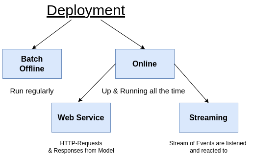
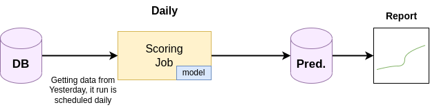
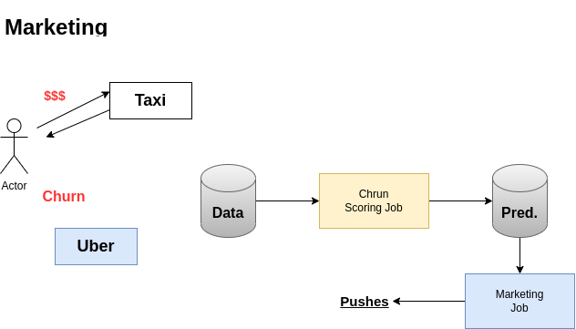
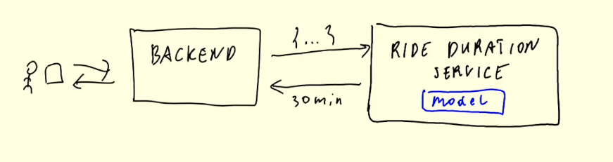
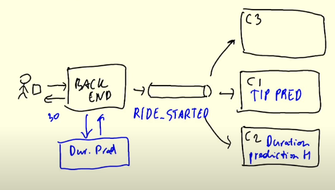

# 4. Model Deployment

## 4.1 Three ways of deploying a model

### MLOps: Design, Train, Experiment and Deploy
- **Design**
    - What are requirements for the problem
    - Knowing if ML is the right solution to tackle the problem
- **Train**
    - Experiment tracking (capture metrics from experiments)
    - Productionizing a Jupyter Notebook; turning a Jupyter notebook into a ML pipeline
    - Output: a trained model
- **Operate**
    - Deploy trained model




- **`Batch Mode`**
    - Run the model regularly (hourly, daily, monthly, etc.)
    - Get the data from the previous time interval
    - Save the results into database of predictions
    - Often used for marketing related tasks



### Batch Mode - Marketin Example

- **Case**: User churning from Taxi to Uber



### Web Service - Trip Duration Example


- <u>1-to-1</u> Relationship (Client & Server)
- A user of an taxi-app wants to know the approximate duration of a trip immediately
- Waiting is not viable here and a Webservice has to be ready to go and predict

### Streaming - Taxi Ride

- <u>1-to-Many</u> Relationship
- Multiple services (consumers) react to streams of events


## 4.2 Web-services: Deploying models with Flask and Docker

Take a look at the Content from the ML-Zoomcamp about deplying models [here](https://github.com/alexeygrigorev/mlbookcamp-code/tree/master/course-zoomcamp/05-deployment).

The content of this section can be found [here](web-service/README.md).

## 4.3 Web-services: Getting the models from the model registry (MLflow)

Initially you have to start an MLflow server with the following command
```bash
mlflow --server --backend-store-uri=sqlite:///mlflow.db --default-artifact-root=s3://<your-s3-bucket>
```

## 4.4 (Optional) Streaming: Deploying models with Kinesis and Lambda 

## 4.5 Batch: Preparing a scoring script

## 4.6 MLOps Zoomcamp 4.6 - Batch: Scheduling batch scoring jobs with Prefect

The unit 4.6 consists of multiple videos:

## 4.7 Choosing the right way of deployment

TODO / COMING SOON

## 4.8 Homework


## Notes

Did you take notes? Add them here:

* [Notes on model deployment (+ creating a modeling package) by Ron M.](https://particle1331.github.io/inefficient-networks/notebooks/mlops/04-deployment/notes.html)
* [Notes on Model Deployment using Google Cloud Platform, by M. Ayoub C.](https://gist.github.com/Qfl3x/de2a9b98a370749a4b17a4c94ef46185)
* [Week4: Notes on Model Deployment by Bhagabat](https://github.com/BPrasad123/MLOps_Zoomcamp/tree/main/Week4)
* [Week 4: Deployment notes by Ayoub.B](https://github.com/ayoub-berdeddouch/mlops-journey/blob/main/deployment-04.md)
* Send a PR, add your notes above this line
