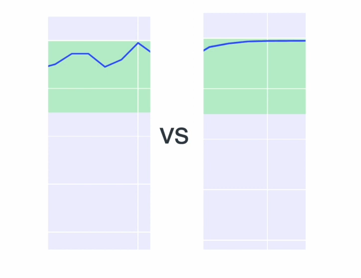
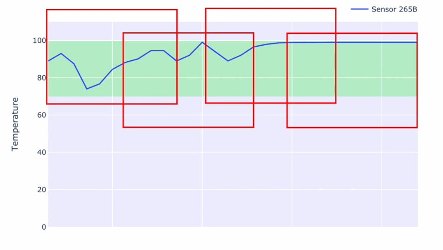
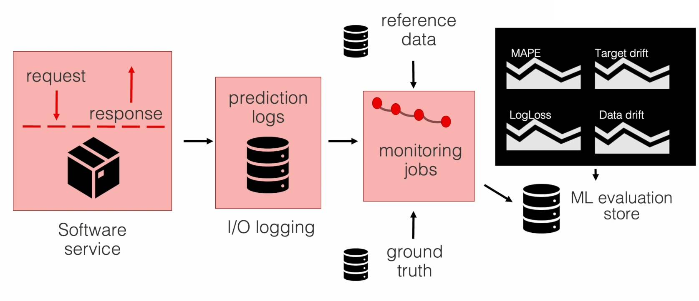
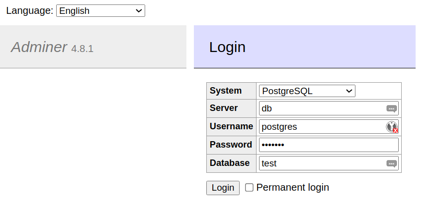

****# 5. Model Monitoring

- 5.1 [Intro to ML monitoring](#1-ml-monitoring-intro)
- 5.2 [Environment setup](#2-env-setup)
- 5.3 [Prepare reference and model](#3-prepare)
- 5.4 [Evidently metrics calculation](#4-metrics-calc)
- 5.5 [Evidently Monitoring Dashboard](#5-dashboard)
- 5.6 [Dummy monitoring](#6-dummy)
- 5.7 [Data quality monitoring](#7-quality-monitoring)
- 5.8 [Save Grafana Dashboard](#8-grafana-dashboard)
- 5.9 [Debugging with test suites and reports](#9-debugging)
- 5.10 [Homework](#10-homework)
 

<a id="1-ml-monitoring-intro"></a>
## 5.1 Intro to ML monitoring

- How to monitor ML models in production
- Avoiding degrading of models by monitoring them and taking appropriate steps

How is ML monitoring different to "regular" monitoring? It adds an additional layer of "stuff" to be monitored!

- **Service Health (a must)**: Uptime, Memory, Latency
- **Model Health and Data Health**: Model accuracy, data drift, concept drift, broken pipelines, schema change, data outage, model bias, underperforming segments

A checklist (what requires what monitoring - a good starting point):

1. **Service health**: Does it work?
2. **Model performance**: How it performs? / Did anything break?
3. **Data quality and integrity**: Where it breaks? / Where to dig further?
4. **Data and concept drift**: Is the model still relevant?

**Comprehensice monitoring:** more things to look at (other than from the list above)

- **Performance by segment**: segmenting data in categories and applying quality metrics by category and monitor them
- **Model bias / fairness**: Imprtant for healthcare and finance (trust in the system)
- **Outlier**: Risk reduction
- **Explainability**: Insight how a decision was made / reasoned
 
### Reusing existing Monitoring Architecture for Machine Learning

#### Batch vs. Online Serving Models

**How to monitor:**

- Add ML metrics to service health monitoring (e.g. Prometheus/Grafana)
- Build an ML-focussed Dashboard (e.g. MongoDB/Grafana or BI Tools like Tableau, Looker)

#### Example with Data Quality: batch models
Based on training data or the past batch:
- *Expected data quality* (e.g. 80% non-constant)
- *Data distribution type* (e.g. normality)
- *Descriptive statistics*: Averages, Median, Quantiles, Min-Max for individual features
  - Point estimates as a simple solution
  - Statistical test to get confidence interval



#### Example with Data Quality: non-batch models
Descriptive statistics and quality:
- Calculate metrics continuously or even incrementally

Statistical tests on a continuous data stream:
- Pick a window function (e.g. moving window with or without moving reference) and "compare" windows




#### Monitoring Scheme

- Can be applied to *batch* and *non-batch* ML model




<a id="2-env-setup"></a>
## 5.2 Environment setup

- Creating conda environment for monitoring
- Dockerization of components using `Docker` with `docker compose`

### Step 1: Creating project and env

```bash
# Creating project folder
mkdir taxi_monitoring
cd taxi_monitoring

# Creating conda env for project
conda create -n py11 python=3.11

# Installing required dependencies
pip install -r requirements.txt
```

### Step 2: Using Docker(-Compose) file
The used docker-compose file can be found here: [docker-compose.yml](taxi_monitoring/docker-compose.yml). 
```yml
version: '3.7'

volumes: 
  grafana_data: {}

networks:
  front-tier:
  back-tier:

services:
  db:
    image: postgres
    restart: always
    environment:
      POSTGRES_PASSWORD: example
    ports:
      - "5432:5432"
    networks:
      - back-tier
  adminer:
    image: adminer
    restart: always
    ports:
      - "8080:8080"
    networks:
      - back-tier
      - front-tier
  grafana:
    image: grafana/grafana
    user: "472"
    ports:
      - "3030:3030"
    volumes:
      - ./config/grafana_datasources.yaml:/etc/grafana/provisioning/datasources/datasource.yaml:ro
    networks:
      - back-tier
      - front-tier
    restart: always
```

The `Grafana`-part of the docker-compose file requires a config for which a folder has to be created

```bash
mkdir configs
cd configs
touch grafana_datasource.yaml
```
The config [grafana_datasources.yaml](taxi_monitoring/config/grafana_datasource.yaml) has the following content:
```yaml

# config file version
apiVersion: 1

# list of datasources to insert/update
# available in the database
datasources:
  - name: PostgreSQL
    type: postgres
    access: proxy
    url: db:5432
    database: test
    user: postgres
    secureJsonData:
      password: 'example'
    jsonData:
      sslmode: 'disable'
      database: test
```
Building and running of the docker compose script can now be done with:
```bash
docker-compose up --build
```
Now `grafana` can be accessed at [localhost:3000](http://localhost:3000), and `adminer` can be accessed at [localhost:8080](http://localhost:8080/)


<a id="3-prepare"></a>
## 5.3 Prepare reference and model

1. Create 2 folders for artifacts:
  - `models`: saving the models
  - `data`: datasets and reference data
2. Create jupyter notebook [`baseline_model_nyc_taxi_data`](taxi_monitoring/baseline_model_nyc_taxi_data.ipynb) for loading, training and saving of model and reference data

<a id="4-metrics-calc"></a>
## 5.4 Evidently metrics calculation

In this section a [***Evidently***](https://www.evidentlyai.com/) report is created which can contain many different metrics related to different metrics of a machine learning pipeline. This can be very useful for future monitoring. The build report can be found in the same notebook a in the previous section [`baseline_model_nyc_taxi_data`](taxi_monitoring/baseline_model_nyc_taxi_data.ipynb).


<a id="5-dashboard"></a>
## 5.5 Evidently Monitoring Dashboard
The code on how to construct a dashboard can be found in the notebook [`baseline_model_nyc_taxi_data`](taxi_monitoring/baseline_model_nyc_taxi_data.ipynb)

After creating a workspace and adding a report to it, the workspace can be opened from the command line with:
```bash
evidently ui
```
This will give you a url that can be opened to see the Evidently UI in the browser. There you can find the Project and the report that was generated. The report will show the same visualizations as the one from the notebook.

There is not yet a dashboard present in the workspace. For this multiple panels are created from the record and added to the project dashboard.

<a id="6-dummy"></a>
## 5.6 Dummy monitoring
In this section some dummy metrics are calculated and loaded into a database, which is then accessed through `Grafana` later. For the aforementioned tasks, the python script [`dummy_metrics_calculation.py`](taxi_monitoring/dummy_metrics_calculation.py) is created. The script should be able to create a database, tables and add metrics to them row by row.

Code for connecting to the database:
```python
def prep_db():
    # Connect to the postgres database that is defined in the prev. used docker-compose file
    with psycopg.connect("host=localhost port=5432 user=postgres password=example", autocommit=True) as conn:
        res = conn.execute("SELECT 1 FROM pg_database WHERE datname='test'")
        if len(res.fetchall()) == 0:  # Create database if no database is available
            conn.execute("create database test;")

```

Code for filling the database with dummy values:
```python
def calculate_dummy_metrics_postgresql(curr):
    value1 = random.randint(0, 1000)
    value2 = str(uuid.uuid4())
    value3 = random.random()
    curr.execute(
        "INSERT INTO dummy_metrics(timestamp, value1, value2, value3) % (%s, %s, %s, %s)",
        (datetime.datetime.now(pytz.timezone("Europe/Berlin")), value1, value2, value3)
    )
```

Main function with loop for putting data in the database:
```python
def main():
    prep_db()
    last_send = datetime.datetime.time() - datetime.timedelta(seconds=10)
    with psycopg.connect("host=localhost port=5432 dbname=test user=postgres password=example", autocommit=True) as conn:
        for i in range(0, 100):
            with conn.cursor() as curr:
                calculate_dummy_metrics_postgresql(curr)

            new_send = datetime.datetime.now()
            seconds_elapsed = (new_send - last_send).total_seconds()
            if seconds_elapsed < SEND_TIMEOUT:
                time.sleep(SEND_TIMEOUT - seconds_elapsed)
            while last_send < new_send:
                last_send = last_send + datetime.timedelta(seconds=10)
            logging.info("data sent")
```

To run the code, the docker-compose has to be started s.t. the code can access to its ressources:
```bash
docker-compose up
# In another console (or with `docker-compose up -d` in same console)
python3 dummy_metrics_calculation.py
```

After inserting some values into the database, you can log-in (using credentials from [docker-compose.yml](taxi_monitoring/docker-compose.yml)) and access the database content via `Adminer` over the browser at [localhost:8080](http://localhost:8080/). You should be able to find the newly created database `test` and the `dummy_metrics` table.



The data in the postgres database can now be used for a `Grafana` dashboard.
1. Open `Grafana` in the browser at [localhost:3000](http://localhost:3000/) and log in
2. Create a dashboard and access the datasource

<a id="7-quality-monitoring"></a>
## 5.7 Data quality monitoring
This section is mostly similar to the previous section `5.6 Dummy Monitoring` but with the difference that `Evidently` was used. The code can be fond here: [`evidently_metrics_calculation.py`](taxi_monitoring/evidently_metrics_calculation.py).

Execution of the code:
```bash
python evidently_metrics_calculation.py
```

<a id="8-grafana-dashboard"></a>
## 5.8 Save Grafana Dashboard

For saving Grafana dashboards some more configurations are reqired. This sections contains the creation of additional configs and detailed instructions can be found here: [MLOps Zoomcamp 5.8 - Save Grafana Dashboard](https://www.youtube.com/watch?v=-c4iumyZMyw) 


<a id="9-debugging"></a>
## 5.9 Debugging with test suites and reports
To find out what's wrong with data or the model, monitoring is used. This shows the moment of time where something went wrong. Now `Debugging` should help find the solution to the occured problem. Debugging in this context means to obtain values and visualizations s.t. you can come up with a possible hypothesis of what happened. For this purpose the notebook [`debugging_nyc_taxi_data.ipynb`](taxi_monitoring/debugging_nyc_taxi_data.ipynb) is used.


<a id="10-homework"></a>
## 5.10 Homework

