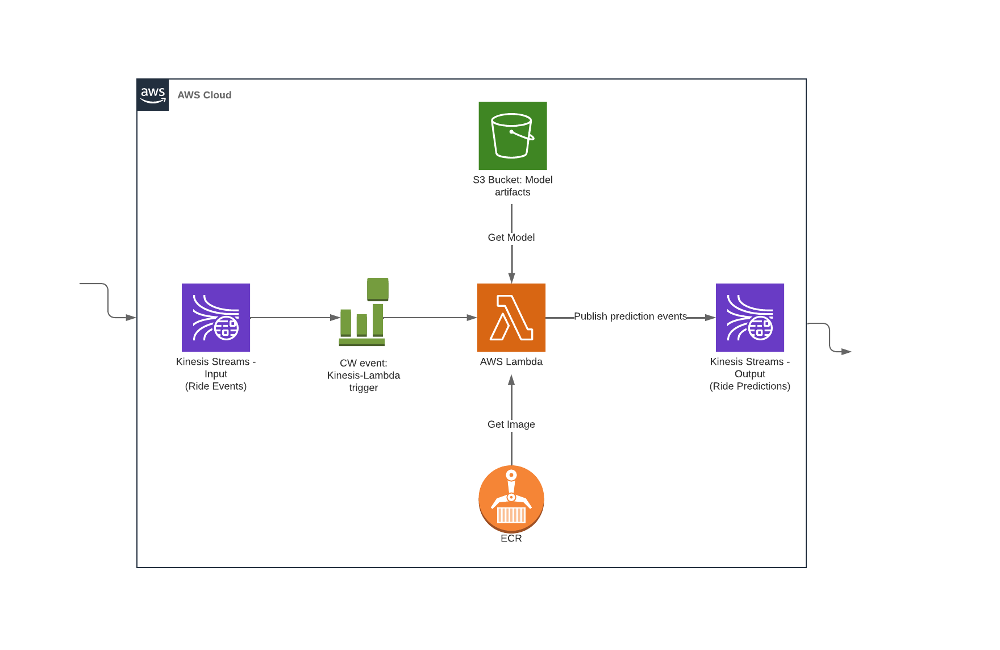

# 6. Best Practices (Part A)

- 6.1 [Testing Python code with pytest](#1-pytest)
- 6.2 [Integration tests with docker-compose](#2-integration-test)
- 6.3 [Testing cloud services with LocalStack](#3-local-stack)
- 6.4 [Code quality: linting and formatting](#4-linting)
- 6.5 [Git pre-commit hooks](#5-git)
- 6.6 [Makefiles and make](#6-make)
- 6.7 [Homework](#7-homework)

<a id="1-pytest"></a>
## 6.1 Testing Python code with pytest
In this section the code that was used for predicting on AWS using Kinesis and Lambda from Section 4 of the class, will be tested. The original code can be found here: [streaming](https://github.com/joweyel/mlops-zoomcamp/tree/main/04-deployment/streaming). 


### Setup

The modified version of the code can be found in the directory [code](./code/).
The goal of this section is to test the code with unit tests.

Everything here is done in the [code](./code/) directory.
 
Installing the *Pipenv* and test-dependencies:
```bash
pipenv install
pipenv install --dev pytest
```
For testing with VS-Code: 
- Install the `Python`-extension
- Select python interpreter with `[Ctrl]+[Shift]+[P]`, then search for `Python: Select Interpreter`
  - *Manually configure the interpreter*
    - Find out path to pipenv: `pipenv --venv`
    - Insert path into `+ Enter interpreter path` and append `/bin/python`
  - *Find Interpreter in Interpreter list (is often already there)*
    - Just click on it!
  - Create `tests` directory in the `code` directory
  
Now open the pipenv and run pytest.
```bash
pipenv shell
pytest
```

### Configure PyTest

The next step is to open the Test-Sidebar in VS-Code (the retort symbol)
- Click on `Configure Python Tests` an select the `tests` directory

Now it's time to test the cpde. The tests can be found in the files of the [`tests`](code/tests/)-directory. While the content from section 4's Streaming folder was initially used it was subsequently adapted to be more suitable to be tested.

The relevant files of this sction are:
- [lambda_function.py](code/lambda_function.py)
- [model.py](code/model.py)
- [model_test.py](code/tests/model_test.py)
- [Dockerfile](code/Dockerfile)
- [test_docker.py](code/test_docker.py)
  

<a id="2-integration-test"></a>
## 6.2 Integration tests with docker-compose

**Types of testing:**
- `Unit-Tests`: Tests a single small "unit" in the code usually functions, methods, etc. by themselves
- `Integration-Tests`: Tests the integration of a code segment into the overall code s.t. the interaction of code with other components works as expected


<a id="3-local-stack"></a>
## 6.3 Testing cloud services with LocalStack

This section handles the testing of cloud ressurces that were left out in the unit- and integration-test sections. For this [localstack](https://github.com/localstack/localstack) is used.

To incorporate `localstack` into the code, `docker-compose` is used. Therefore the previously used docker-compose configuration is extended by the service `kinesis`:

```yaml
services:
  backend:
    image: ${LOCAL_IMAGE_NAME}
    ports:
      - "8080:8080"
    environment:
      - PREDICTIONS_STREAM_NAME=ride_predictions
      - TEST_RUN=True
      - RUN_ID=Test123
      - AWS_DEFAULT_REGION=us-east-1
      - AWS_PROFILE=mlflow-user
      - MODEL_LOCATION=/app/model
    volumes:
      - ~/.aws:/root/.aws
      - ./model:/app/model
  kinesis:
    image: localstack/localstack
    ports: 
      - 4566:4566
    environment:
      - SERVICES=kinesis
```
To pull the `localstack`-image (at first start) and to run the `kinesis`-service the following command has to be used:
```bash
docker-compose up kinesis
```

The goal now is to use local versions of AWS services, that are simulated by `localstack`. To see what `kinesis`-streams are currently running you can use this command:
```bash
aws kinesis list-streams
```
If there are any, you can delete them since they are not used here and are costing you money even in idle-state. If all streams are deleted you should get this result from `aws kinesis list-streams`:
```json
{
    "StreamNames": [],
    "StreamSummaries": []
}
```
Now it's time to connect to the kinesis-stream that was started with the localstack-container.
```bash
aws --endpoint-url=http://localhost:4566 kinesis list-streams
```
If everything worked out, you should get this output:
```json
{
    "StreamNames": []
}
```

Now create a stream with localstack:
```bash
aws --endpoint-url=http://localhost:4566 \
    kinesis create-stream \
    --stream-name ride_predictions \
    --shard-count 1
```

You should now see the strem in the stream list in localstack:
```bash
aws --endpoint-url=http://localhost:4566 kinesis list-streams
{
    "StreamNames": [
        "ride_predictions"
    ]
}
```


To obtain predictions from the stream the following commands can be used:

```bash
export SHARD='shardId-000000000000'
export PREDICTIONS_STREAM_NAME='ride_predictions'

# Get shard iterator
SHARD_ITERATOR=$(aws --endpoint-url=http://localhost:4566 \
    kinesis get-shard-iterator \
    --shard-id ${SHARD} \
    --shard-iterator-type TRIM_HORIZON \
    --stream-name ${PREDICTIONS_STREAM_NAME} \
    --query 'ShardIterator' \
)

# Extracting records from shard
RESULT=$(aws --endpoint-url=http://localhost:4566 kinesis get-records --shard-iterator $SHARD_ITERATOR)

# Getting the predictions and decode them
echo $RESULT | jq -r '.Records[0].Data' | base64 --decode
```

The result of a test run returned the following output:
```json
{
    "model": "ride_duration_prediction_model", 
    "version": "Test123", 
    "prediction": {
      "ride_duration": 21.432393319299262, 
      "ride_id": 256
    }
}
```

To make everything more compact and testable instead of running every command in the commmand line, everything will be packaged in the python script [test_kinesis.py](code/integration-test/test_kinesis.py). The test is also included in [run.sh](code/integration-test/run.sh):

```bash
...
pipenv run python3 test_kinesis.py 

ERROR_CODE=$?

if [ ${ERROR_CODE} != 0 ]; then
    docker-compose logs
    docker-compose down
    exit ${ERROR_CODE}
fi

docker-compose down
```

For re-execution of `run.sh`, docker-compose has to be stopped first.
```bash
docker-compose down
./run.sh
```

### Conclusion
To run the created tests you can now use the following commands (in `code`-directory):
```bash
# Unit tests
pipenv run pytest tests/
# Integration tests
./integration-test/run.sh
```


<a id="4-linting"></a>
## 6.4 Code quality: linting and formatting

<u>The two important concepts of this section:</u>
- **Linting:** Process of analyzing source code to identify potential errors, improve code quality, and enforce coding standards
- **Formatting:** Deals with the visual arrangement of code, including aspects like indentation, line breaks, and spacing

### Installing `Pylint` to lint Python code
```bash
pipenv install --dev pylint


pipenv shell      # Activate environment
pylint model.py   # Example for linting

# Linting all the code recursively starting from "."
pylint --recursive=y .
```

It is also possible to select and configure a linter in VSCode by installing the VSCode extension of the linter `Pylint`. 

### Excluding certain warnings from the linter (3 different ways)
- **Version 1 (VSCode config):**
  - To exclude certain warnings, go to the settings by typing `[Ctrl]+[,]` and search for pylint. In the **`args`**-part of the pylint settings you can disable warnings by typing `--disable=<Warning-ID>`. 
- **Version 2 (.pylintrc)**:
  - create the file [`.pylintrc`](code/.pylintrc)  in the `code` directory and add the following code to disable certain warnings
    ```ini
    [MESSAGE CONTROL]
 
    disable=missing-function-docstring,
            missing-final-newline,
            missing-class-docstring
    ```
- **Version 3 (pyproject.toml)**:
  - Allows to configure python projects, including linting:
    ```ini
    [tool.pylint.message_control]
    disable = [ # warnings to exclude
        "missing-function-docstring",
        "missing-final-newline",
        "missing-class-docstring",
        "missing-module-docstring"
    ]
    ```

To explicitly exclude pylint warnings in specific functions / methods / classes locally, you can just add the following to the code of the component:
```python
# Example of locally disabling warnings
def get_model_location(run_id):
    # pylint: disable=missing-function-docstring
    ...
    return model_location
```

### Code formatting with `black` and `isort`

- **`black`**: A code formatter for python code
- **`isort`**: Library for sorting python imports according to some guideline + compatibility with `black`

Parameterization of `black` is done via parameter or via `pyproject.toml`
```bash
black --line-length 80 --skip-string-normalization --target-version py39 
```

```ini
[tool.black]
line-length = 80
target-version = ['py39']
skip-string-normalization = true
```

Now `black` can be run with the following command:
```bash
black .  # already parameterized by `pyproject.toml` in [tool.black]
```

To apply `isort` the same syntax as black can be used:
```bash
isort . # already parameterized by `pyproject.toml` in [tool.isort]
```

### Conclusion
Linting, formatting and sorting of imports can all be done automatically, given some rules. This makes them very easy to use in CI/CD pipelines, in which they are often used.
- **Linting - `pylint`**: Assures code quality
- **Formatting - `black`**: Assumes formatting according to a given set of rules
- **Sorting - `isort`**: Sorts imports in the code according to a given set of rules
  

When putting everything together (after configuring each component), you get commands like this:
```bash
isort .
black .
pylint --recursive=y .
pytest tests
```

<a id="5-git"></a>
## 6.5 Git pre-commit hooks
When committing code to Git it should habe ideally been processed with the 4 commands above. However manually calling them every time it is possible to automate `isort`, `black` and `pylint`. For this <u>Git uses pre-commit hooks</u>. 

The processing via pre-commit hooks can be done the python package `pre-commit`:
```bash
pipenv install --dev pre-commit
```

To use it in a specific (sub-)folder of the Git-Repo you are currently working in you can initialize an "empty" repo in this folder with `git init`. Normally hooks are handled in the repos configuration, however the need to only apply the hooks only to one folder makes this not viable. This local repository is however only temporary and `.git` is removed after this section is done. 

```bash
cd code
git init
```

Running `pre-commit` for first time and getting a sample pre-commit config:
```bash
pre-commit sample-config  # writes to stdout
pre-commit sample-config > .pre-commit-config.yaml  # write to file
```

Next step is to create a pre-commit hook in the git-folder `.git/hooks/`:
```bash
pre-commit install
# Looking into the file 
less .git/hooks/pre-commit
```

The step of installing pre-commit is required on every computer that wants to use them since the `.git` folder is local only and is updated with newer commits from the repo.

**Create `.gitignore`, `add` and `commit files`**

1. Create gitignore file that excludes `__pycache__`
2. Run `git add .` to add all files from the current folder
3. Run `git commit -m "initial commit"` to trigger the pre-commit hooks
4. Look at `git diff` to see the differences
5. Run `git add .` to add the changed files to be committed
6. Run `git commit -m "fixes from pre-commit default hooks"` to commit the changed files

**Adding `isort` and `black`, `pylint` and `pytest` to the hooks**

```yaml
# See https://pre-commit.com for more information
# See https://pre-commit.com/hooks.html for more hooks
repos:
 - repo: https://github.com/pre-commit/pre-commit-hooks
   rev: v4.6.0
   hooks:
    - id: trailing-whitespace
    - id: end-of-file-fixer
    - id: check-yaml
    - id: check-added-large-files
 - repo: https://github.com/pycqa/isort
   rev: 5.13.2
   hooks:
    - id: isort
      name: isort (python)
 - repo: https://github.com/psf/black
   rev: 24.4.2
   hooks:
     - id: black
       language_version: python3.9
 - repo: local
   hooks:
     - id: pylint
       name: pylint
       entry: pylint
       language: system
       types: [python]
       require_serial: true
       args:
         [
           "-rn", # Only display messages
           "-sn", # Don't display the score
           "--recursive=y"
         ]
 - repo: local
   hooks:
    - id: pytest-check
      name: pytest-check
      entry: pytest
      language: system
      pass_filenames: false
      always_run: true
      args: [
        "tests/"
      ]
```

If you are getting errors with [`pyproject.toml`](code/pyroject.toml) there is a possibility that you specified the wrong versions of the used libraries in the hooks. To remedy this you can automatically update / change to the library version you have with `pre-commit autoupdate`.

When a file files pytest then it will not be moved to the commit stage but still remains in the `untracked` / `modified` state.

Now you can delete the `.git` folder to redo it again an test if the commit goes through:
```bash
rm -rf .git
pre-commit intall
git add .
git commit -m "initial commit"
```

<a id="6-make"></a>
## 6.6 Makefiles and `make`

The usage of the tool `make` can help automating 

### Creating a Makefile
```bash
touch Makefile  # thats it
```
- Running the makefile is done by first writing `make` and then followed by the name of the part you want to execute. In the example below an example would be `make build` or `make quality_control`.

The content with its different rules can be found in the the [`Makefile`](code/Makefile)
```bash
# Parameter for the makefile (relevant for docker)
LOCAL_TAG=$(shell date +"%Y-%m-%d-%H-%M")
LOCAL_IMAGE_NAME:="stream-model-duration:${LOCAL_TAG}"

# `make test` - runs tests
test:
	pytest tests/


# `make quality_checks` - runs quality check programs
quality_checks:
	isort .
	black .
	pylint --recursive=y .

# `make build`
build: quality_checks test
	docker build -t ${LOCAL_IMAGE_NAME} .

# `make integration_test`
integration_test: build
	LOCAL_IMAGE_NAME=${LOCAL_IMAGE_NAME} bash integration-test/run.sh

# `make publish`
publish: build integration_test
	LOCAL_IMAGE_NAME=${LOCAL_IMAGE_NAME} bash scripts/publish.sh

# `make setup` - installs libraries required for tests and quality checks
setup:
	pipen install --dev 
	pre-commit install
```


<a id="7-homework"></a>
## 6.7 Homework


# 6. Best Practices using Infrastructure-as-Code (IaC) with Terraform (Part B)

- 6B.TF [Terraform Summary](#tf-summary)
- 6B.1 [Terraform - Introduction](#1b-tf-intro)
- 6B.2 [Terraform - Modules and Outputs variables](#2b-modules-vars)
- 6B.3 [Terraform - Build an e2e workflow for Ride Predictions](#3b-workflow)
- 6B.4 [Terraform - Test the pipeline e2e](#4b-test)
- 6b.CI/CD [CI/CD Summary](#cicd-summary)
- 6B.5 [CI/CD - Introduction](#5b-cicd-intro)
- 6B.6 [CI/CD - Continuous Integration](#6b-ci)
- 6B.7 [CI/CD - Continuous Delivery](#7b-cd)
- [Alternative CI/CD Solutions](#alternatives)

## Project infrastructure moodules:
- <u>**Amazon Web Services (AWS)**</u>
  - `Kinesis`: Streams (Producer and Consumer)
  - `Lambda`: Serving API
  - `S3 Bucket`: Model artifacts
  - `ECR`: Image Registry



<a id="tf-summary"></a>
## Terraform Summary

- Setting up a stream-based pipeline infrastructure in AWS, using Terraform
- Project infrastructure modules (AWS): Kinesis Streams (Producer & Consumer), Lambda (Serving API), S3 Bucket (Model artifacts), ECR (Image Registry)

<a id="1b-tf-intro"></a>
## 6B.1 Terraform - Introduction

### Setup

**Installation**:

* [aws-cli](https://docs.aws.amazon.com/cli/latest/userguide/getting-started-install.html) (both versions are fine)
* [terraform client](https://www.terraform.io/downloads)

**Configuration**:

1. If you've already created an AWS account, head to the IAM section, generate your secret-key, and download it locally. 
[Instructions](https://docs.aws.amazon.com/cli/latest/userguide/getting-started-prereqs.html)

2. [Configure]((https://docs.aws.amazon.com/cli/latest/userguide/getting-started-quickstart.html)) `aws-cli` with your downloaded AWS secret keys:
      ```shell
         $ aws configure
         AWS Access Key ID [None]: xxx
         AWS Secret Access Key [None]: xxx
         Default region name [None]: eu-west-1
         Default output format [None]:
      ```

3. Verify aws config:
      ```shell
        $ aws sts get-caller-identity
      ```

4. (Optional) Configuring with `aws profile`: [here](https://docs.aws.amazon.com/cli/latest/userguide/cli-configure-sourcing-external.html) and [here](https://registry.terraform.io/providers/hashicorp/aws/latest/docs#using-an-external-credentials-process) 


<a id="2b-modules-vars"></a>
## 6B.2 Terraform - Modules and Outputs variables

### Modules
A *module* in Terraform is a container for multiple resources that are used together. Modules can be used to create lightweight abstractions, so that you can describe your infrastructure in terms of its architecture, rather than directly in terms of physical objects.

### Creating Terraform files and starting the project
```bash
touch main.tf variables.tf
```

The following code has to be inserted to the [main.tf](code/infrastructure/main.tf):
```python
terraform {
  required_version = ">= 1.0"
  backend "s3" {  # where TF-States are stored (to keep track)
    bucket = "tf-state-mlops-zoomcamp-jw"
    key = "mlops-zoomcamp.tfstate"
    region = "us-east-1"
    encrypt = true
  }
}
```
- Now you have to create the bucket, that you have specified in the `backend` parameter. This has to be done manually to let Terraform store the tfstate files there, where all the changes are tracked and saved.

### Creating a kinesis Terraform module (+creating some other folders for later)
```bash
mkdir modules
cd modules
mkdir ecr kinesis lambda s3
cd kinesis
# Create files
touch main.tf variables.tf
# Fill with required content
```
The content of the created files can be found here: [main.tf](code/infrastructure/modules/kinesis/main.tf), [variables.tf](code/infrastructure/modules/kinesis/variables.tf)
- `main.tf`
  ```python
  # Create Kinesis Data Stream

  resource "aws_kinesis_stream" "stream" {
      name                = var.stream_name
      shard_count         = var.shard_count
      retention_period    = var.retention_period
      shard_level_metrics = var.shard_level_metrics
      tags = {
          CreatedBy = var.tags
      }
  }

  # to get the arn output of the kinesis stream
  output "stream_arn" {
      value = aws_kinesis_stream.stream.arn
  }
  ```

To add new stuff to the overall project the previous version of the architecture will be deleted. For this the following command can be used:
```bash
terraform delete
```
You also have to provide the name of the kinesis-stream, just like during `terraform plan`.


<a id="3b-workflow"></a>
## 6B.3 Terraform - Build an e2e workflow for Ride Predictions

In this section the rest of the pipeline (seen in the image above) will be defined with Terraform. Previously only one kinesis-stream was created with Terraform.

### Creating two Kinesis streams (in `infrastructure/main.tf`)

```python
# ride_events
module "source_kinesis_stream" {
  source           = "./modules/kinesis" # module to load
  retention_period = 48                  # 2 days retention period
  shard_count      = 2                   # number of shards to process data
  stream_name      = "${var.source_stream_name}_${var.project_id}"
  tags             = var.project_id
}

# ride_predictions
module "output_kinesis_stream" {
  source           = "./modules/kinesis" # module to load
  retention_period = 48                  # 2 days retention period
  shard_count      = 2                   # number of shards to process data
  stream_name      = "${var.output_stream_name}_${var.project_id}"
  tags             = var.project_id
}
```

### Creating S3 module

In `modules/s3` the following files are created: [main.tf](code/infrastructure/modules/s3/main.tf), [variables.tf](code/infrastructure/modules/s3/variables.tf)

```python
resource "aws_s3_bucket" "s3_bucket" {
    bucket = var.bucket_name
    # acl = "private"
}

output "name" {
    value = aws_s3_bucket.s3_bucket.bucket
}
```

When running `terraform plan` and `terraform apply`, the following parameter have to be provided:

- **var.model_bucket**: `stg-mlflow-models-jw` (must be unique)
- **var.output_stream_name**: `stg_ride_predictions`
- **var.source_stream_name**: `stg_ride_events`

With this 2 kinesis streams and 1 bucket are configured and ready to be applied to the cloud. For this run:
```bash
terraform apply
```

### Creating ECR module
In this part a docker registry to store images is created. These images are then for the lambda service to use in predicting. Usually, the services that are listed in the root `main.tf` are created in parallel. However lambda and ecr have dependencies to the two kinesis streams and the s3 bucken and can therefore not be created in parallel. Otherwise the resources will not be found.

The code can be found in the files [main.tf](code/infrastructure/modules/ecr/main.tf) and [variables.tf](code/infrastructure/modules/ecr/variables.tf)

Content of `modules/ecr/main.tf`:
```python
resource "aws_ecr_repository" "repo" {
  name                 = var.ecr_repo_name
  image_tag_mutability = "MUTABLE"

  image_scanning_configuration {
    scan_on_push = false
  }
}

## Very important
# In practice, the Image build-and-push step is handled separately by the CI/CD pipeline and not the IaC script.
# But because the lambda config would fail without an existing Image URI in ECR,
# we can also upload any base image to bootstrap the lambda config, unrelated to your Inference logic
resource "null_resource" "ecr_image" {
  triggers = { # md5 hashes to `lamnda_function.py` and `Dockerfile` (rebuild if changes in hash are found)
    python_file = "md5(file(var.lambda_function_local_path))"
    docker_file = "md5(file(var.docker_image_local_path))"
  }
  # login to ecr, build image, then push it to the registry
  provisioner "local-exec" {
    command = <<EOF
             aws ecr get-login-password --region ${var.region} | docker login --username AWS --password-stdin ${var.account_id}.dkr.ecr.${var.region}.amazonaws.com
             cd ../
             docker build -t ${aws_ecr_repository.repo.repository_url}:${var.ecr_image_tag} .
             docker push ${aws_ecr_repository.repo.repository_url}:${var.ecr_image_tag}
         EOF
  }
}

# Wait for the image to be uploaded, before lambda config runs
data "aws_ecr_image" "lambda_image" {
  depends_on = [
    null_resource.ecr_image
  ]
  repository_name = var.ecr_repo_name
  image_tag       = var.ecr_image_tag
}

output "image_uri" {
  value = "${aws_ecr_repository.repo.repository_url}:${data.aws_ecr_image.lambda_image.image_tag}"
}
```

Addition in `main.tf`:
```python
module "ecr_image" {
  source                     = "./modules/ecr"
  ecr_repo_name              = "${var.ecr_repo_name}_${var.project_id}"
  account_id                 = local.account_id
  lambda_function_local_path = var.lambda_function_local_path
  docker_image_local_path    = var.docker_image_local_path
}
```

The ECR component also requires the input of many variables at run-time. This was managable when there was only Kinesis and S3, now there are quite a few more variables required. To remedy this, you can create a file to save variables to, that is read when running terraform apply / plan. These files are so-called `tfvars`-files that can contain e.g. variables for staging, production etc.

For variable file for staging can be found in [vars/stg.tfvars](code/infrastructure/vars/stg.tfvars):
```python
source_stream_name         = "stg_ride_events"
output_stream_name         = "stg_ride_predictions"
model_bucket               = "stg-mlflow-models-jw"
lambda_function_local_path = "../lambda_function.py"
docker_image_local_path    = "../Dockerfile"
ecr_repo_name              = "stg_stream_model_duration"
```

You have to use this command to call terraform apply / plan withe the variables above:
```bash
# Should show 2 new resouces to create (if kinesis and s3 resources were not deleted)
terraform plan -var-file=vars/stg.tfvars

# May take some time (especially for pushing the docker image to ECR)
terraform apply -var-file=vars/stg.tfvars
```

### Creating Lambda Function module
**Important**: It is required that the user that is used for terraform has the ability to create and work with IAM policies.

Files of this part of the project:

- [modules/lambda/main.tf](code/infrastructure/modules/lambda/main.tf)
- [modules/lambda/variables.tf](code/infrastructure/modules/lambda/variables.tf)
- [modules/lambda/iam.tf](code/infrastructure/modules/lambda/iam.tf) (Needed to let lambda interact with both kinesis streams)

Similar to the ECR module, there is a dependecy to the kinesis input stream. This means that the input stream has to be existing to be referenced. 


After everything is defined, lets re-initialize the project and apply the changes:
```bash
terraform init 
terraform plan -var-file=vars/stg.tfvars
terraform apply -var-file=vars/stg.tfvars
```


<a id="4b-test"></a>
## 6B.4 Terraform - Test the pipeline e2e

Now that the End-2-End Pipelin is up and running it is time to test the pipeline with some input. For this we send data to the ride-events kinesis stream. 

### Configuring environment variables for Lambda

Before we can run anything we still have to configure the Environment variables of `kinesis_lambda` in [main.tf](code/infrastructure/modules/lambda/main.tf). These 3 variables are:
- **Otuput Kinesis-Stream**: `PREDICTIONS_STREAM_NAME` (where results are sent to)
- **Model bucket**:  `MODEL_BUCKET` (models are saved here)
- **Run ID**: `RUN_ID` (for choosing the model)

For configuring all 3 variablesm the script [deploy_manual.sh](code/scripts/deploy_manual.sh) is used:
```bash
#!/usr/bin/env bash

export MODEL_BUCKET_PROD="stg-mlflow-models-jw-mlops-zoomcamp"
export PREDICTIONS_STREAM_NAME="stg_ride_predictions-mlops-zoomcamp"
export LAMBDA_FUNCTION="stg_ride_prediction_lambda_mlops-zoomcamp"

# Model artifacts bucket from the prev. weeks (MLflow experiments)
export MODEL_BUCKET_DEV="mlflow-artifacts-remote-jw"

# Get latest RUN_ID from latest S3 partition.
# NOT FOR PRODUCTION!
# In practice, this is generally picked up from your experiment tracking tool such as MLflow or DVC
export RUN_ID=$(aws s3api list-objects-v2 --bucket ${MODEL_BUCKET_DEV} \
--query 'sort_by(Contents, &LastModified)[-1].Key' --output=text | cut -f2 -d/)

# NOT FOR PRODUCTION!
# Just mocking the artifacts from training process in the Prod env
aws s3 sync s3://${MODEL_BUCKET_DEV} s3://${MODEL_BUCKET_PROD}

# Set new var RUN_ID in existing set of vars.
variables="{PREDICTIONS_STREAM_NAME=${PREDICTIONS_STREAM_NAME}, MODEL_BUCKET=${MODEL_BUCKET_PROD}, RUN_ID=${RUN_ID}}"

# https://docs.aws.amazon.com/lambda/latest/dg/configuration-envvars.html
aws lambda update-function-configuration --function-name ${LAMBDA_FUNCTION} --environment "Variables=${variables}"
```

After coyping all relevant artifacts to the `MODEL_BUCKET_PROD` bucket you can start to send events to the input kinesis stream:
```bash
# Specify the stream to send events to
export KINESIS_STREAM_INPUT="stg_ride_predictions-mlops-zoomcamp"

# The sending
SHARD_ID=$(aws kinesis put-record  \
        --stream-name ${KINESIS_STREAM_INPUT}   \
        --partition-key 1  --cli-binary-format raw-in-base64-out  \
        --data '{"ride": {
            "PULocationID": 130,
            "DOLocationID": 205,
            "trip_distance": 3.66
        },
        "ride_id": 156}'  \
        --query 'ShardId' \
        --output text
  )
```


<a id="cicd-summary"></a>
## CI/CD Summary

- Automate a complete CI/CD pipeline using GitHub Actions to automatically trigger jobs to build, test, and deploy our service to Lambda for every new commit/code change to our repository.
-  The goal of our CI/CD pipeline is to execute tests, build and push container image to a registry, and update our lambda service for every commit to the GitHub repository.


<a id="5b-cicd-intro"></a>
## 6B.5 CI/CD - Introduction


<a id="6b-ci"></a>
## 6B.6 CI/CD - Continuous Integration


<a id="7b-cd"></a>
## 6B.7 CI/CD - Continuous Delivery


<a id="alternatives"></a>
## Alternative CI/CD Solutions

